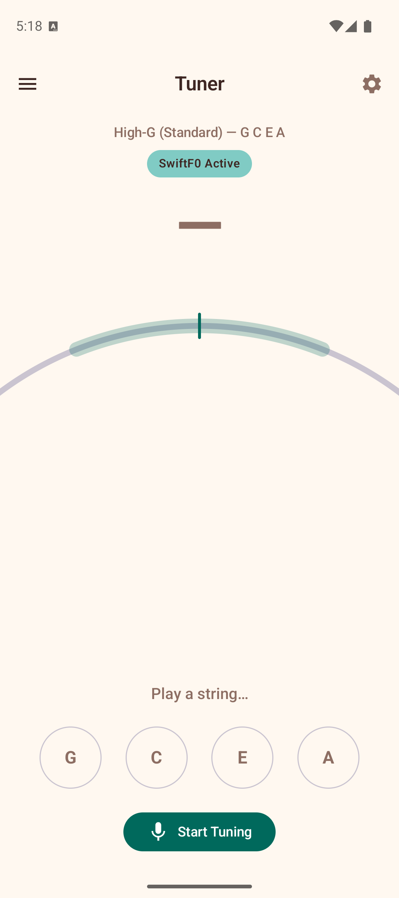
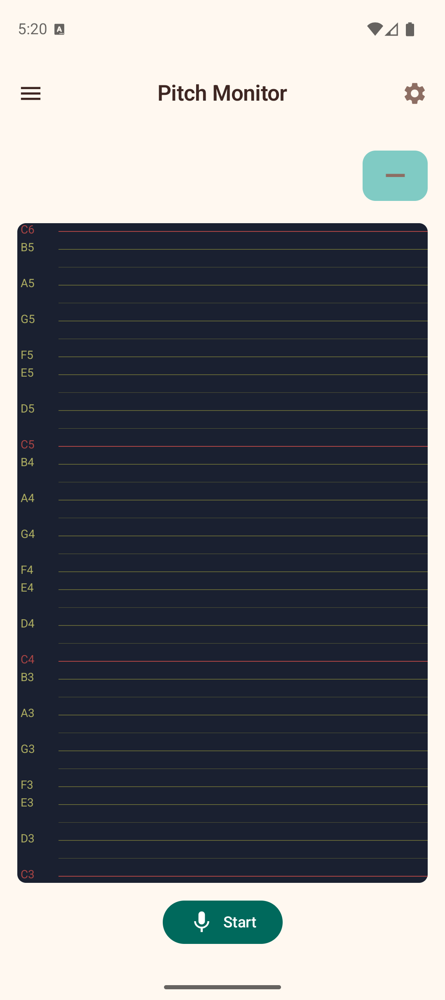
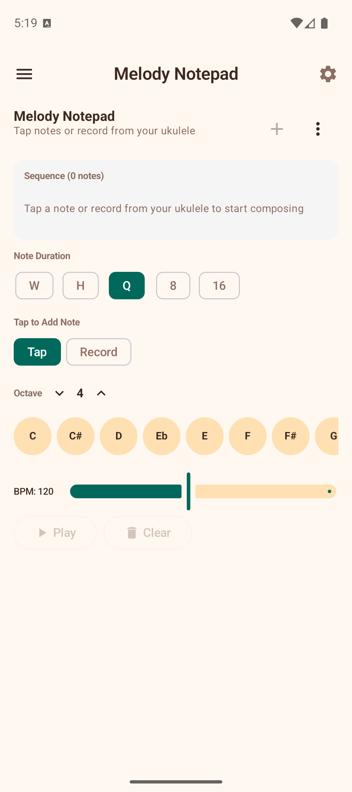
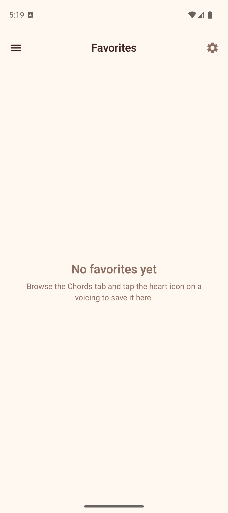
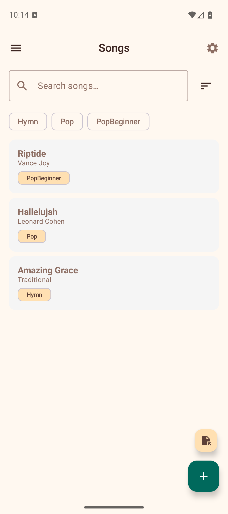
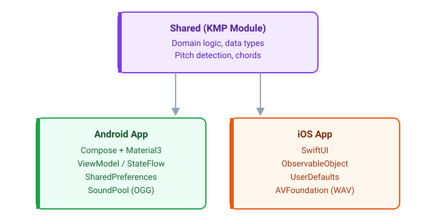

<p align="center">
  
</p>

<h1 align="center">🎵 Ukulele Companion</h1>

<p align="center">
  <b>An offline app for learning ukulele — on Android and iOS</b><br>
  Chords, scales, music theory, composition tools, and more.<br>
  Built with <b>Kotlin Multiplatform</b>, <b>Jetpack Compose</b>, and <b>SwiftUI</b>.
</p>

<p align="center">
  <a href="https://play.google.com/store/apps/details?id=com.baijum.ukufretboard">
    
  </a>
  <a href="https://apps.apple.com/app/id6760328302">
    
  </a>
</p>

<p align="center">
  <a href="https://kotlinlang.org"></a>
  <a href="https://developer.android.com/compose"></a>
  <a href="https://developer.apple.com/xcode/swiftui/"></a>
  <a href="https://developer.android.com/about/versions/oreo"></a>
  <a href="LICENSE"></a>
  <a href="https://github.com/baijum/ukulele-companion/actions/workflows/android.yml"></a>
  <a href="https://codecov.io/gh/baijum/ukulele-companion"></a>
</p>

---

## ✨ Features

<table>
<tr>
<td width="50%" valign="top">

### 🎸 Interactive Fretboard Explorer
Tap fret positions on a visual ukulele fretboard (standard GCEA tuning, frets 0–12) and the app instantly detects and displays the chord. Supports 20 chord types across triads, sevenths, suspended, and extended chords. Shows alternate notational symbols ("Also written as") so you can recognize chords written in different styles.

### 📚 Chord Library
Browse playable voicings for any chord. Select a root note, category (Triad, Seventh, Suspended, Extended), and chord type to see algorithmically generated voicings displayed as mini fretboard diagrams.

### 🔄 Transpose
Shift chords up or down by semitones with +/- buttons. Shows the capo equivalent for easy reference.

### 🧠 Neural-Powered Tuner
The tuner now uses a hybrid pipeline: fast YIN pitch tracking on every frame, supervised by SwiftF0 neural inference at intervals. This improves robustness against octave mistakes and unstable frames while preserving responsive needle movement.

### 🥁 Strumming & Fingerpicking Patterns
A reference guide with 15 strumming and 11 fingerpicking patterns — from beginner to advanced — in 4/4, 3/4, and 6/8 time. Each pattern includes visual beat/step display, notation, description, and a **play button with adjustable tempo** so you can hear what each pattern sounds like. Create custom patterns with adjustable beat counts (2–16) and time signatures, or duplicate any preset to make your own variations.

### 🎶 Chord Progressions
Common chord progressions for any key across seven modes (Major, Minor, Dorian, Phrygian, Lydian, Mixolydian, Locrian). Each chord chip shows its harmonic function (Tonic, Subdominant, Dominant) with colour coding. Includes Pop, Classic Rock, 50s, Folk, Jazz ii-V-I, Reggae, and more. Create custom progressions with diatonic chord suggestions from the selected scale, duplicate presets, copy to clipboard, and use tap tempo for practice.

</td>
<td width="50%" valign="top">

### 🎼 Scale Overlay
Highlight notes from any of 38 scales (Major, Natural/Harmonic/Melodic Minor, Pentatonic, Blues, modes, Bebop, Diminished, and more) directly on the fretboard. Filter by fret position and see the diatonic chords for each scale.

### ⭐ Favorites
Long-press any voicing in the Chord Library to save it. Access your saved voicings from the dedicated Favorites tab.

### 📝 Song Chord Sheets
Create a personal songbook with lyrics and inline chord markers (e.g., `Some[C]where over the [Em]rainbow`). Search, sort, and label songs for easy organisation. Associate strum patterns, use quick-insert chord chips in the editor, and preview chords above lyrics in real time. Tap any chord name to view its voicings. Transpose songs with +/- controls and **Save in this key** to permanently rewrite chords. Share via a format picker offering ChordPro, plain text, or clipboard copy.

### 🎵 Metronome
A standalone practice metronome with adjustable BPM (30–300), tap tempo, time signatures (2/4 to 7/4), customizable accent patterns, and subdivisions (quarter, eighth, triplet, sixteenth). Visual beat indicators pulse in time.

### 🎹 Melody Notepad
Compose melodies by tapping notes, recording from your ukulele's microphone, or using the **step sequencer** — a grid of 8 or 16 steps for building loops and rhythmic patterns. Choose note durations, set the octave, and play back at any tempo. Save and load multiple melodies.

### ✍️ Songwriter Mode
A guided **"Start a Song"** flow that walks you through picking a key and scale, building a chord progression from diatonic suggestions, writing lyrics with inline chords, transposing, and saving to your songbook — all in one place.

### 🔊 Sound Playback
Hear chords played back using sampled ukulele audio. Notes are strummed with a configurable delay between strings.

### 🎓 Music Theory & Learning
Theory lessons, ear training, interval trainer, circle of fifths, glossary, scale practice, achievements, and more.

</td>
</tr>
</table>

## 📱 Screenshots

### Android

<p align="center">
  
  
  
</p>
<p align="center">
  
  
  
</p>
<p align="center">
  
  
  
</p>
<p align="center">
  
  
  
</p>

### iOS

<p align="center">
  
  
  
</p>
<p align="center">
  
  
  
</p>

<p align="center">
  <a href="https://www.youtube.com/playlist?list=PL4GycHdD--uonaifRHrBvNU7ym5jAVs8c">
    
  </a>
  <br>
  <sub>Watch the feature guide playlist</sub>
</p>

### ⚙️ Settings

- **Display**: Light/Dark/System/High Contrast theme, show/hide Learn and Reference sections
- **Tuning**: High-G (standard), Low-G, Baritone, D-Tuning, and more
- **Fretboard**: Left-handed mode (mirrors the fretboard)
- **Sound**: Enable/disable, volume, strum delay, note duration, play on tap

### ♿ Accessibility

Ukulele Companion is designed to be usable by everyone, including blind and visually impaired musicians:

- **TalkBack support** (Android): All interactive elements have descriptive content descriptions for Android's screen reader
- **VoiceOver support** (iOS): All views include accessibility labels, traits, and hints for Apple's screen reader
- **Heading semantics**: Screen titles and section headers are marked as headings for efficient screen reader navigation
- **Live regions**: Dynamic content like tuner readings, chord detection, and pitch monitoring are announced by screen readers as they change
- **Canvas alternatives**: Visual-only components (tuner meter, chord diagrams, fretboard, pitch monitor, Circle of Fifths) have text descriptions for screen readers
- **High contrast theme**: A high-contrast color scheme is available in Display settings (Android and iOS)
- **Logical focus order**: Navigation follows a logical order for keyboard and switch access users

---

## 🏗️ Tech Stack

| Component | Android | iOS |
|-----------|---------|-----|
| Language | Kotlin 2.3 | Swift + Kotlin (via KMP) |
| UI | Jetpack Compose + Material 3 | SwiftUI |
| Architecture | ViewModel + StateFlow | ObservableObject + @Published |
| Shared Logic | Kotlin Multiplatform (`:shared` module) | Same KMP module via framework |
| Audio | SoundPool with OGG samples | AVFoundation with WAV samples |
| Persistence | SharedPreferences + DataStore | UserDefaults |
| Serialization | Kotlinx Serialization | Codable + JSONSerialization |
| Neural Inference | ONNX Runtime Android | ONNX Runtime C API (xcframework) |
| Build | Gradle 9.3, AGP 9.0, Kotlin DSL | Xcode, min iOS 17.0 |
| Min SDK | 26 (Android 8.0) | iOS 17.0 |
| Target SDK | 35 | — |
| Localization | Android resources (16 locales) | Localizable.xcstrings (16 locales) |

---

## 📁 Project Structure

```
ukulele-companion/
├── shared/                          # Kotlin Multiplatform shared module
│   └── src/
│       ├── commonMain/              # 55 Kotlin files — domain + data logic
│       │   ├── domain/              # ChordDetector, PitchDetector, Transpose, etc.
│       │   └── data/                # Notes, Scales, ChordFormulas, Progressions, etc.
│       ├── androidMain/             # Android platform actuals (UUID, Calendar)
│       └── iosMain/                 # iOS platform actuals (NSUUID, NSDate)
│
├── app/                             # Android app module
│   └── src/main/java/com/baijum/ukufretboard/
│       ├── audio/                   # SoundPool, metronome, audio capture
│       ├── data/                    # Repositories (SharedPreferences), backup/restore
│       ├── domain/                  # NeuralPitchSupervisor, AchievementChecker
│       ├── ui/                      # 55 Compose screens and components
│       └── viewmodel/               # 13 ViewModels (StateFlow)
│
├── iosApp/                          # iOS app (SwiftUI)
│   └── UkuleleCompanion/
│       ├── Views/                   # 48 SwiftUI views
│       ├── ViewModels/              # 15 ObservableObject ViewModels
│       ├── Audio/                   # AudioCaptureEngine, TonePlayer, NeuralPitchSupervisor
│       ├── Helpers/                 # Accessibility helpers, backup/restore manager
│       └── Resources/               # WAV samples, ONNX model
```

---

## 🚀 Getting Started

### Prerequisites

- **Android**: [Android Studio](https://developer.android.com/studio) (latest stable — Ladybug or newer), JDK 11+
- **iOS**: [Xcode](https://developer.apple.com/xcode/) 16+, macOS

### Clone & Build

```bash
git clone https://github.com/baijum/ukulele-companion.git
cd ukulele-companion

# Android
./gradlew assembleDebug

# iOS (requires macOS)
cd iosApp && ./setup_onnxruntime.sh && cd ..
xcodebuild -project iosApp/UkuleleCompanion.xcodeproj \
  -scheme UkuleleCompanion \
  -destination 'platform=iOS Simulator,name=iPhone 16 Pro' \
  build
```

The Android debug APK will be at `app/build/outputs/apk/debug/app-debug.apk`.

### Run on Emulator or Device

- **Android**: Open the project in Android Studio, select a device/emulator, and click **Run** (or press `Shift+F10`).
- **iOS**: Open `iosApp/UkuleleCompanion.xcodeproj` in Xcode, select a simulator or device, and click **Run** (or press `Cmd+R`). The ONNX Runtime xcframework must be set up first via `iosApp/setup_onnxruntime.sh`.

### Run Tests

```bash
# Unit tests (including property-based fuzz tests)
./gradlew testDebugUnitTest

# Instrumented tests (requires emulator or device)
./gradlew connectedAndroidTest

# UI stress test with Android Monkey (requires emulator or device)
./scripts/monkey_test.sh            # 10,000 random events
./scripts/monkey_test.sh 42         # reproducible with seed
./scripts/monkey_test.sh 42 50000   # 50,000 events with seed
```

The project includes **property-based tests** using [Kotest](https://kotest.io/docs/proptest/property-based-testing.html) that generate thousands of random inputs to verify invariants in the domain logic (chord detection, transposition, FFT, pitch detection, and more). These run automatically as part of `testDebugUnitTest` and in CI on every push and PR.

### Release Build

**Android:**

1. Create a `keystore.properties` file in the project root:

```properties
storeFile=path/to/your/keystore.jks
storePassword=your_store_password
keyAlias=your_key_alias
keyPassword=your_key_password
```

2. Build the release bundle:

```bash
./gradlew bundleRelease
```

The AAB will be at `app/build/outputs/bundle/release/app-release.aab`.

---

## 🤝 Contributing

**Contributions are welcome!** Whether you're fixing a bug, adding a feature, improving documentation, or refactoring code — we'd love your help.

Please read the [Contributing Guide](CONTRIBUTING.md) for detailed instructions on development setup, code guidelines, and the PR process. All participants are expected to follow our [Code of Conduct](CODE_OF_CONDUCT.md).

### How to Contribute

1. **Fork** the repository
2. **Create a branch** for your feature or fix (`git checkout -b feature/my-feature`)
3. **Make your changes** and test them
4. **Commit** with a clear message (`git commit -m "Add: description of change"`)
5. **Push** to your fork (`git push origin feature/my-feature`)
6. **Open a Pull Request** describing what you changed and why

### 🤖 AI-Assisted Contributing

We actively encourage contributors to use **AI coding tools** to accelerate their work on this project. The codebase is well-structured and AI-friendly:

- **Use [Cursor](https://cursor.com), [GitHub Copilot](https://github.com/features/copilot), or similar AI tools** to explore the codebase, understand patterns, and generate code that fits the existing architecture.
- **Leverage AI for code reviews** — before submitting a PR, ask an AI assistant to review your changes for consistency with the project's patterns.
- **Use AI to write tests** — expand the existing test suite with new unit tests, property-based fuzz tests, or UI tests.
- **AI-powered documentation** — use AI tools to help write clear commit messages, PR descriptions, and inline documentation.

> **Tip:** This project uses standard Kotlin + Jetpack Compose patterns on Android and SwiftUI on iOS, with shared domain logic via Kotlin Multiplatform. AI tools work exceptionally well with the codebase because it follows consistent conventions throughout.

### Code Style

- **Shared module**: Kotlin with official code style (Kotlin Multiplatform)
- **Android UI**: Jetpack Compose + Material 3 — no XML layouts
- **iOS UI**: SwiftUI
- **Android state**: ViewModel + StateFlow
- **iOS state**: ObservableObject + @Published
- Follow existing patterns in the codebase — consistency is valued

### Architecture at a Glance

<p align="center">
  
</p>

- **Shared module**: 55 Kotlin files — chord detection, pitch detection, scales, notes, transposition, and all domain/data logic shared across platforms
- **Android UI layer**: 55 Compose files, single-activity architecture via `MainActivity`
- **Android ViewModel layer**: 13 ViewModels managing state with `StateFlow`
- **iOS UI layer**: 48 SwiftUI views with full feature parity
- **iOS ViewModel layer**: 15 ObservableObject ViewModels
- **Audio layer**: Platform-specific audio capture, tone playback, and ONNX neural pitch detection

---

## 📖 Documentation

- **Website**: https://baijum.github.io/ukulele-companion/
- **Privacy policy**: https://baijum.github.io/ukulele-companion/privacy-policy/

Detailed feature documentation and a user manual are available in the [`docs/`](docs/) directory:

- **Design specs**: Architecture and feature proposals in [`docs/spec/`](docs/spec/)
- **User manual**: Step-by-step guide in [`docs/manual/`](docs/manual/)

---

## 📖 Companion Book

**[The Complete Ukulele Learning Book](https://archive.org/details/ukulele-book)** is a free PDF guide covering foundations, developing skills, mastery, and a songbook -- from first strums to jazz voicings and fingerstyle. Designed to pair with Ukulele Companion as a structured learning path.

---

## 📲 Download

Ukulele Companion is free on both platforms:

<p align="center">
  <a href="https://play.google.com/store/apps/details?id=com.baijum.ukufretboard">
    
  </a>
  <a href="https://apps.apple.com/app/id6760328302">
    
  </a>
</p>

---

## 🙏 Attribution

Audio samples are from the "Ukelele single notes, close-mic" pack by
[stomachache](https://freesound.org/people/stomachache/packs/8545/) on
Freesound.org, licensed under
[CC BY 3.0](https://creativecommons.org/licenses/by/3.0/).
See [ATTRIBUTION.md](ATTRIBUTION.md) for full details.

---

## 📜 License

This project is licensed under the [MIT License](LICENSE).

---

<p align="center">
  <b>Built with ❤️ for ukulele players everywhere</b><br>
  <sub>Star the repo if you find it useful — it helps others discover the project!</sub>
</p>
