---
hide:
  - navigation
  - toc
---

# Ukulele Companion

<section class="hero-shell">
  

    

      
      Ukulele Companion
    

    
Free. Offline. Ad-free.

    <h1>The complete practice companion for ukulele players.</h1>
    

      Master chords, explore scales, train your ear, and build real songs in one
      beautiful experience designed for daily practice — on Android and iOS.
    

    

      
      <a href="manual/" class="md-button md-button--primary">Start with the Manual</a>
      <a href="https://github.com/baijum/ukulele-companion" class="md-button">View on GitHub</a>
    

    

      
<strong>30+</strong>learning screens

      
<strong>100%</strong>offline capable

      
<strong>0</strong>ads or tracking

    

  

  

    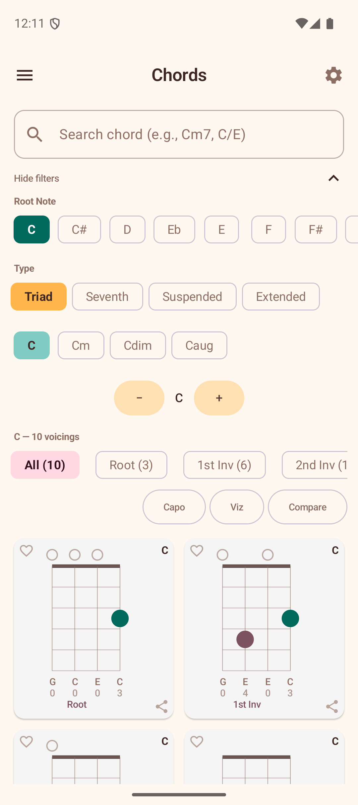
    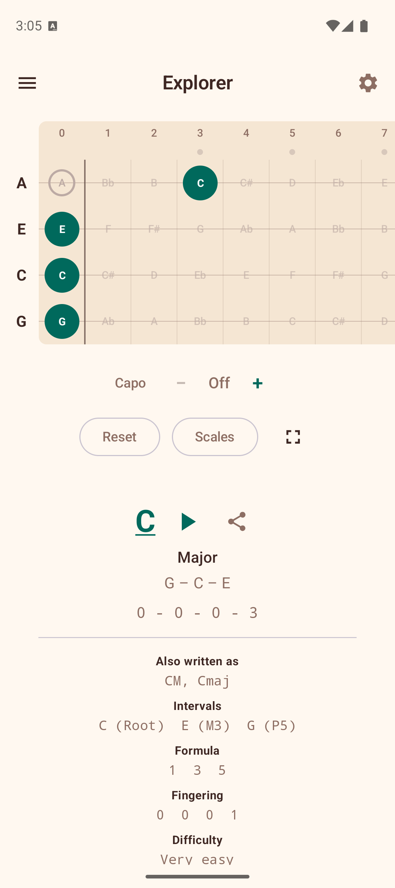
  

</section>

  <svg viewBox="0 0 1440 80" preserveAspectRatio="none" xmlns="http://www.w3.org/2000/svg">
    <path d="M0,40 C360,80 720,0 1080,40 C1260,60 1380,50 1440,40 L1440,0 L0,0 Z" fill="currentColor"/>
  </svg>

<section class="value-strip">
  Chord Detection
  Scale Overlay
  Progressions
  Ear Training
  Song Chord Sheets
  Circle of Fifths
</section>

## Built for focused practice

<section class="section-alt">

  <article class="feature-card">
    &#127929;
    <h3>Interactive Fretboard</h3>
    
Tap notes and instantly detect chords with visual feedback that mirrors your actual instrument.

  </article>
  <article class="feature-card">
    &#129504;
    <h3>Smart Learning Flow</h3>
    
Seamlessly move from chord lookup to progressions, scales, and training without losing context.

  </article>
  <article class="feature-card">
    &#127926;
    <h3>Play, Not Configure</h3>
    
No login, no account setup, and no tracking prompts interrupting your creative flow.

  </article>
  <article class="feature-card">
    &#127932;
    <h3>Music Theory That Clicks</h3>
    
Use practical visuals like the circle of fifths and interval tools to connect theory with the songs you love.

  </article>

</section>

## Android experience

  <figure>
    
    <figcaption>Real-time chord detection</figcaption>
  </figure>
  <figure>
    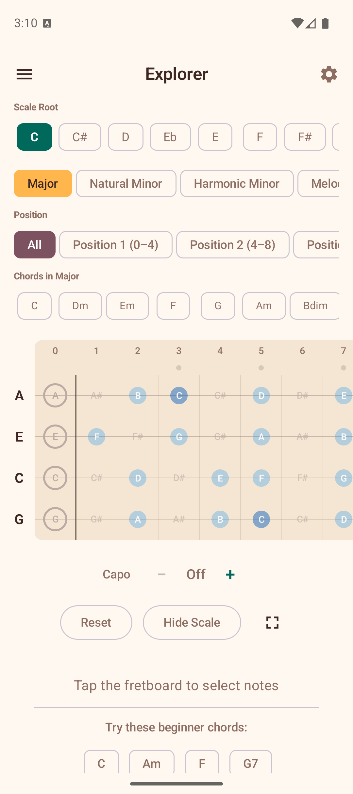
    <figcaption>Scale notes on fretboard</figcaption>
  </figure>
  <figure>
    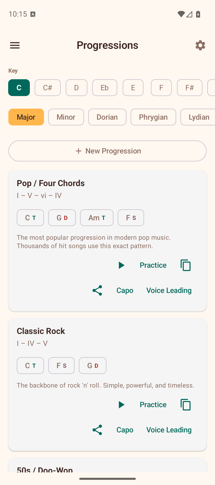
    <figcaption>Practice progressions in any key</figcaption>
  </figure>
  <figure>
    
    <figcaption>Playable voicing library</figcaption>
  </figure>
  <figure>
    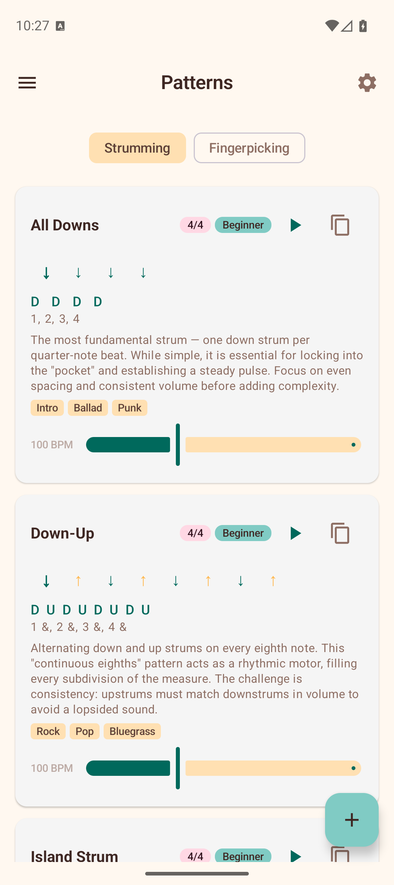
    <figcaption>Strumming and rhythm patterns</figcaption>
  </figure>
  <figure>
    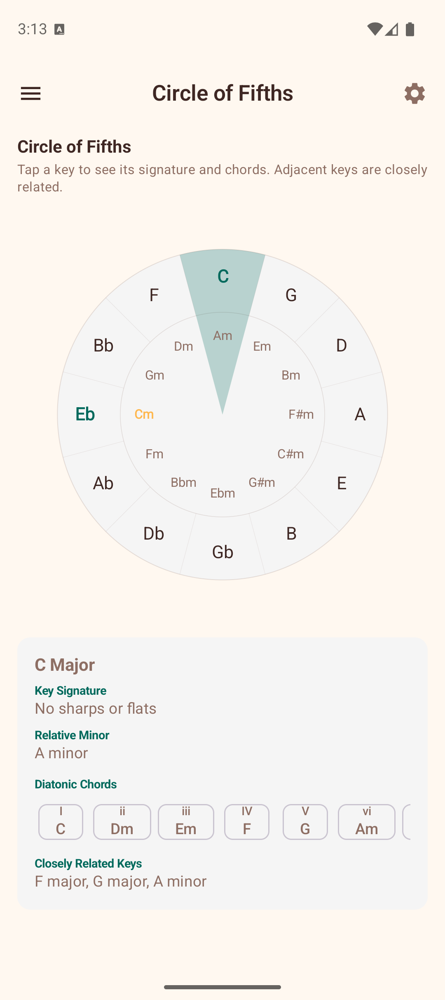
    <figcaption>Visual music theory tools</figcaption>
  </figure>

## iOS experience

  <figure>
    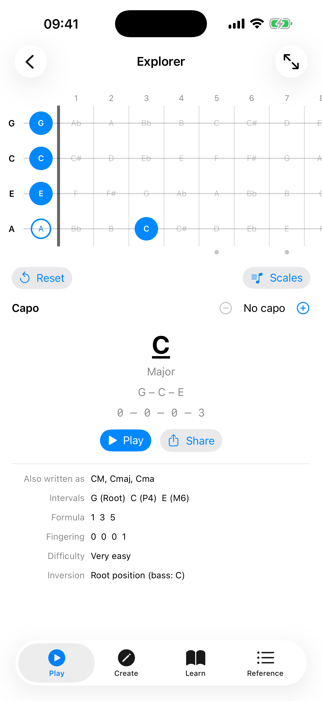
    <figcaption>Interactive fretboard explorer</figcaption>
  </figure>
  <figure>
    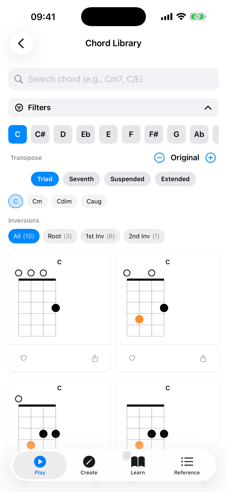
    <figcaption>Playable voicing library</figcaption>
  </figure>
  <figure>
    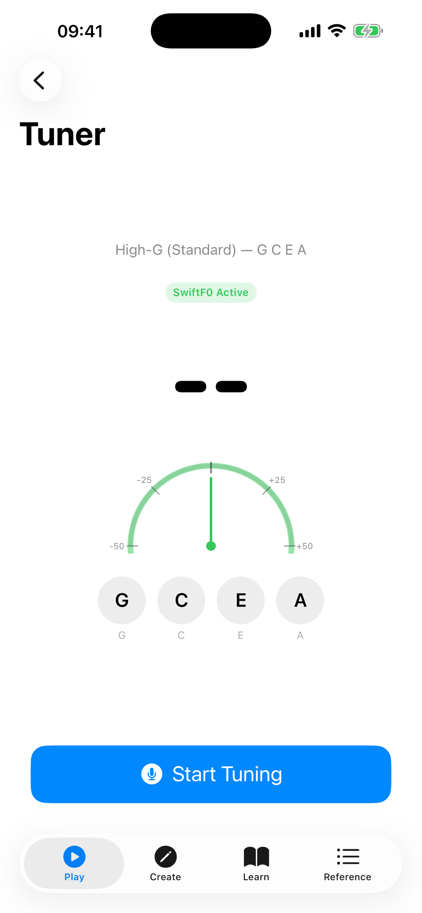
    <figcaption>Chromatic tuner</figcaption>
  </figure>
  <figure>
    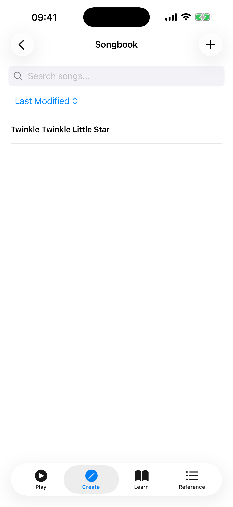
    <figcaption>Personal songbook</figcaption>
  </figure>
  <figure>
    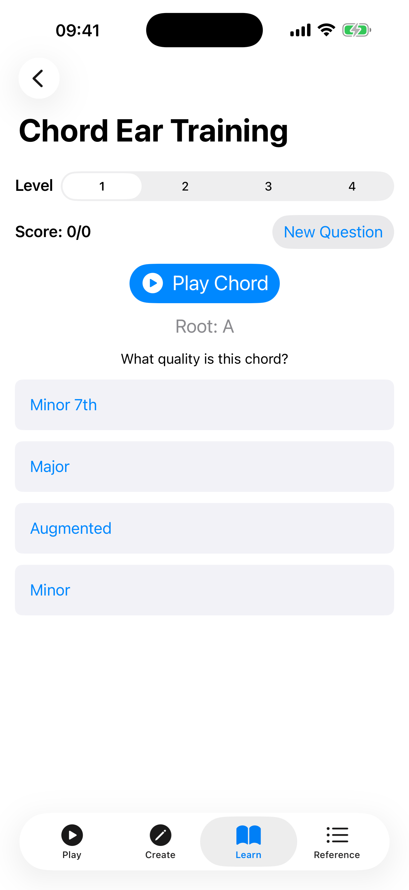
    <figcaption>Practice and learning tools</figcaption>
  </figure>
  <figure>
    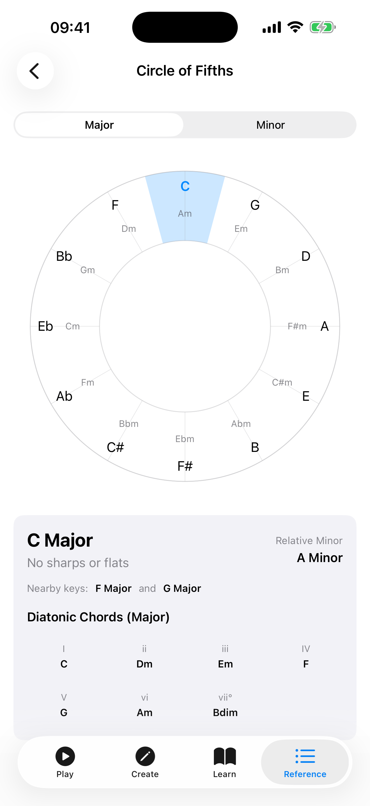
    <figcaption>Visual music theory tools</figcaption>
  </figure>

## See it in action

  
  
Watch the feature guide playlist

<section class="cta-panel cta-playstore">
  <h2>Download on Android</h2>
  
Free, offline, and ad-free. Available now on Google Play.

  

    
  

</section>

<section class="cta-panel cta-testflight">
  <h2>Try the iOS beta via TestFlight</h2>
  
Get early access to new features on iPhone and iPad before they go live.

  

    <a href="https://testflight.apple.com/join/Zpq8kzm6" class="md-button md-button--primary">Join the TestFlight Beta</a>
  

</section>

<section class="cta-panel cta-manual">
  <h2>Start playing better in minutes</h2>
  
Use the manual to get up and running, then explore the feature that matches your current goal.

  

    <a href="manual/" class="md-button md-button--primary">Read manual overview</a>
    <a href="manual/android/01-getting-started/" class="md-button">Go to getting started</a>
  

  

    <a href="privacy-policy/">Privacy Policy</a>
  

  

    Made with care by Baiju Muthukadan
  

</section>
