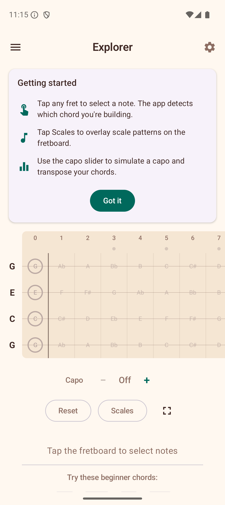
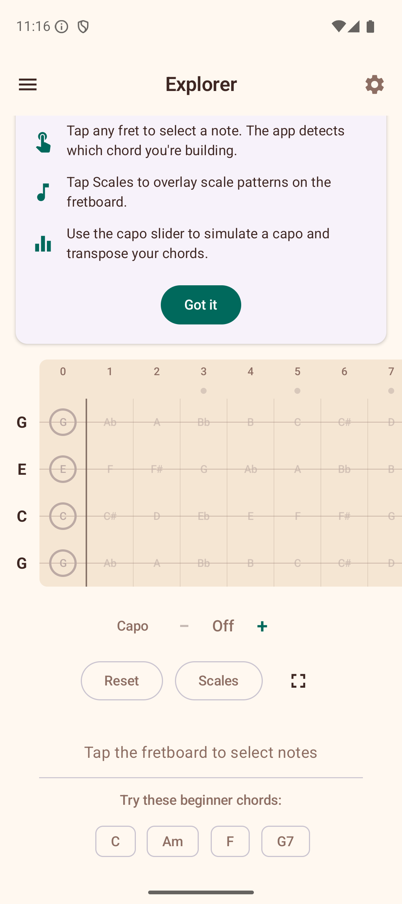
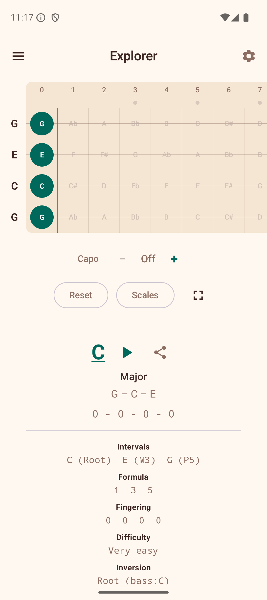

# Explorer

The Explorer is the main screen of Ukulele Companion. It shows an interactive fretboard where you can tap fret positions and the app instantly detects and displays the chord you are playing.

## Tips for First-Time Users

The first time you visit the Explorer, a **tips card** appears at the top of the screen with a brief explanation of the three key features:

- **Tap any fret** to select a note — the app detects which chord you are building.
- **Tap Scales** to overlay scale patterns on the fretboard.
- **Use the capo slider** to simulate a capo and transpose your chords.

Tap **Got it** to dismiss the card permanently.

## Suggested Beginner Chords

When no frets are selected, the area below the fretboard shows a **"Try these beginner chords"** section with four common ukulele chords: **C**, **Am**, **F**, and **G7**. Tap any chip to load the chord onto the fretboard instantly. This is a quick way to hear what the chords sound like and see the fingering. Tap **Reset** to clear the fretboard and see the suggestions again.

## Tapping Notes

Tap any fret cell on the fretboard to place or remove a finger. The fretboard displays frets 0 through 12 across four strings (G, C, E, A in standard tuning).

As you tap frets, the app analyzes the selected notes and shows the detected chord name above the fretboard. The app recognizes 20 chord types across four categories:

- **Triads** — Major, Minor, Diminished, Augmented
- **Seventh** — Dom7, Min7, Maj7, Aug7, Dim7, Minor Major 7th
- **Suspended** — Sus2, Sus4, 7sus4
- **Extended** — 6, Min6, 9, Min9, Add9

### Chord Detail Info

When a chord is detected, the area below the fretboard shows detailed information:

- **Chord name** — with slash notation for inversions (e.g., C/E).
- **Quality** — e.g., "Major", "Minor 7th (1st Inv)".
- **Also written as** — alternate notational symbols used in different musical traditions. For example, detecting "Cdim" also shows "C°", and "Cmaj7" also shows "CM7, CΔ7, C^7". This helps you recognize the same chord written in different styles across books, apps, and sheet music.
- **Alternate interpretations** — when the same set of notes can form a different chord (e.g., Am7 and C6 share the same notes).
- **Intervals, Formula, Fingering, Difficulty, Inversion** — detailed music theory breakdown.

## Transpose

Below the detected chord, you will see **+** and **-** buttons to transpose the chord up or down by semitones. The app also shows the equivalent capo position for reference.

## Scale Overlay

The scale overlay highlights notes from a selected scale directly on the fretboard. This is helpful for understanding which notes fit within a key while you explore chords.

To use the scale overlay:

1. Tap the **Scales** button below the fretboard.
2. Select a **root note** (e.g., C, G, D).
3. Select a **scale type** (Major, Natural Minor, Harmonic Minor, Melodic Minor, Pentatonic Major, Pentatonic Minor, Blues, Dorian, Mixolydian, or Lydian).

Scale notes are highlighted on the fretboard, with the root note shown in a distinct color.

### Scale Positions

When a scale is active, a row of **Position** chips appears. These let you focus on a specific fret range:

- **All** — shows all scale notes across the entire fretboard (default).
- **Position 1, 2, 3...** — limits the highlighted notes to a specific fret range, making it easier to practice one position at a time.

Tap a position chip to filter, and tap **All** to go back to showing every note.

### Key-Aware Note Spelling

When a scale overlay is active, the fretboard automatically uses the correct note spelling for that key. For example, in the key of F major, the note between A and B is shown as "Bb" (flat), while in the key of G major, the note between F and G is shown as "F#" (sharp). This follows standard music theory conventions.

### Chords in This Scale

Below the position chips, the app lists the **chords that naturally occur** in the selected scale. Tap any chord chip to jump to its voicings in the Chord Library.

## Did You Know?

When no frets are selected, the Explorer shows a rotating **"Did you know?"** card with tips about ukulele history, music theory, chord notation, and practice techniques. Tap **Next tip** to see another one. These tips cover topics like:

- Ukulele facts and history (origins, tuning, famous players).
- Music theory nuggets (intervals, chord construction, the Circle of Fifths).
- Chord notation conventions (what symbols like °, +, and Δ7 mean).
- Practice advice (using a metronome, fingerpicking, recording yourself).

## Sound Playback

If sound is enabled in Settings, the app plays back the notes when you tap the fretboard. You can also tap the **Play** button to hear the current chord strummed. See [Settings](08-settings.md) for sound options.

## Full-Screen Mode

Tap the **full-screen icon** in the top-right corner to expand the fretboard to fill the entire screen, hiding the top bar and other controls.
