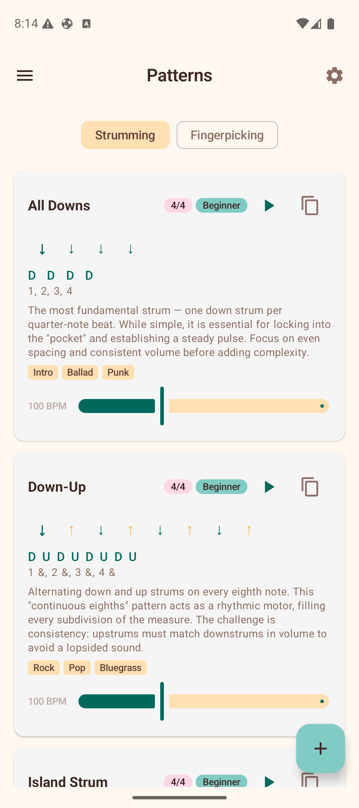
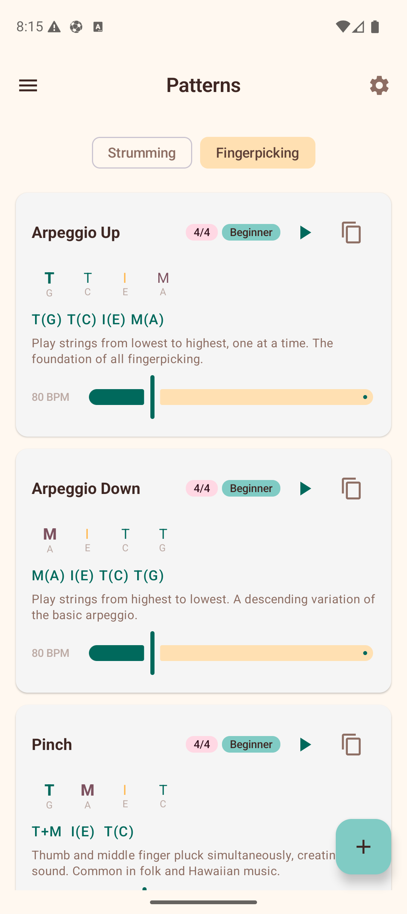

# Patterns

The Patterns section provides a reference guide for strumming and fingerpicking patterns with audio playback. Use the toggle chips at the top to switch between the two views.

## Strumming Patterns

The **Strumming** tab shows a list of preset strumming patterns, from beginner to advanced. Each pattern card includes:

- **Name** — e.g., "Island Strum", "Calypso", "6/8 Ballad".
- **Time signature badge** — shows the time signature the pattern is designed for (e.g., 4/4, 3/4, 6/8).
- **Difficulty badge** — Beginner, Intermediate, or Advanced.
- **Play button** — tap the play icon to hear the pattern played on open strings. The currently active beat highlights as it plays. Tap the stop icon to stop playback. Only one pattern plays at a time.
- **Duplicate button** — tap the copy icon to duplicate any pattern (preset or custom) into your custom patterns. The copy appears in "My Patterns" with " (Copy)" appended to the name.
- **Visual beat arrows** — down arrows, up arrows, chuck, and miss/pause indicators showing the rhythmic pattern. The active beat is highlighted during playback.
- **Notation** — a text representation of the pattern (e.g., "D - D U - U D U").
- **Description** — a brief explanation of the pattern and when to use it.
- **Genre tags** — musical styles the pattern suits (e.g., Hawaiian, Pop, Folk).
- **BPM slider** — adjust the playback tempo. Defaults to the midpoint of the pattern's suggested range.

### Managing Custom Patterns

Tap the **+ button** (floating action button) in the bottom-right corner to create your own strumming pattern:

1. Enter a **pattern name**.
2. Select a **time signature** (2/2, 2/4, 3/4, 4/4, 5/4, 7/4, 6/8, 7/8, 9/8, 11/8, or 12/8).
3. Tap each **beat slot** to cycle through directions: Down, Up, Chuck, Miss, and Pause.
4. Tap the **accent row** below to toggle emphasis on individual beats (accented beats are shown louder/bolder).
5. Tap **Save** to add it to your custom patterns.

Your custom patterns appear in a **"My Patterns"** section at the top of the list. Custom patterns have additional actions:

- **Edit** — tap the pencil icon to open the pattern in the editor with all fields pre-populated for modification.
- **Duplicate** — tap the copy icon to create a copy you can then edit independently.
- **Delete** — tap the trash icon. A confirmation dialog appears before the pattern is permanently removed.

## Fingerpicking Patterns

The **Fingerpicking** tab shows reference patterns for fingerstyle playing, including patterns in 4/4, 3/4, and 6/8 time. Each card includes:

- **Name** — e.g., "Arpeggio Up", "Travis Pick", "6/8 Arpeggio", "Clawhammer".
- **Time signature badge** — shows the time signature (e.g., 4/4, 3/4, 6/8).
- **Difficulty badge** — Beginner or Intermediate.
- **Play button** — tap to hear each note plucked in sequence on the open strings. The active step highlights during playback.
- **Duplicate button** — copy any pattern into your custom patterns.
- **Finger step display** — color-coded indicators showing which finger (Thumb, Index, Middle, Ring) plucks which string (G, C, E, A) at each step. The active step is highlighted during playback.
- **Notation** — a text representation of the fingerpicking sequence (e.g., "T(G) T(C) I(E) M(A)").
- **Description** — guidance on technique and musical context.
- **BPM slider** — adjust the playback tempo.

The finger indicators use distinct colors for each finger, making it easy to follow the picking pattern visually. Emphasized steps are shown in a bolder weight.

### Creating Custom Fingerpicking Patterns

Tap the **+ button** on the Fingerpicking tab to create your own pattern:

1. Enter a **pattern name**.
2. Select a **time signature** from the available options.
3. Adjust the number of steps (2–8) with the +/− buttons.
4. Tap a step to select it, then choose the **finger** and **string** from the chip rows below.
5. Tap the **accent row** to toggle emphasis on individual steps.
6. Tap **Save** to add it to your custom patterns.

Custom fingerpicking patterns support the same **edit**, **duplicate**, and **delete** actions as custom strumming patterns.

## Tips

- Start with the beginner patterns and work your way up.
- Use the **play button** to hear each pattern — listening is much more effective than reading notation alone.
- Adjust the **BPM slider** to start slow and gradually increase speed as you get comfortable.
- Playback uses the open strings of your selected tuning, so it matches whatever tuning you have configured in Settings.
- Use **duplicate** to copy a preset pattern, then **edit** it to create your own variation.
- The time signature badge helps you match patterns to songs — most pop/rock is 4/4, waltzes are 3/4, and ballads like "House of the Rising Sun" are 6/8.
