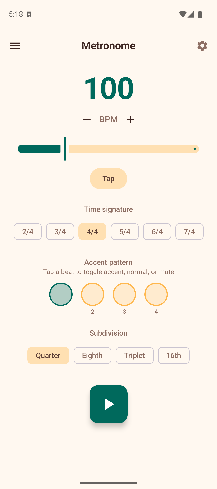

# Metronome

The Metronome provides a standalone rhythm tool for practice. It plays audible click sounds at a steady tempo with customizable time signatures, accent patterns, and subdivisions.

## BPM Control

The large number at the top displays the current tempo in beats per minute.

- **Slider** — drag to quickly set a tempo between 30 and 300 BPM.
- **+/- buttons** — tap for fine adjustments of 1 BPM at a time.
- **Tap Tempo** — tap the "Tap" button rhythmically to set the BPM by feel. The app calculates the average tempo from your taps. After 3 seconds of inactivity, the tap history resets.

You can change the BPM while the metronome is playing — the new tempo takes effect on the next beat.

## Time Signature

Select from 2/4, 3/4, 4/4, 5/4, 6/4, or 7/4 using the filter chips. The default is 4/4. Changing the time signature updates the number of beat indicators and resets the accent pattern.

## Accent Pattern

A row of circles represents each beat in the measure. The first beat is accented by default (shown with a filled primary-color circle). Tap any beat circle to cycle through three states:

- **Accent** (filled circle) — plays a higher-pitched click at full volume.
- **Normal** (outlined circle) — plays a standard click.
- **Mute** (dotted circle) — silent beat, no click but the visual indicator still pulses.

Customizing the accent pattern lets you practice different feels — for example, accenting beats 1 and 3 in 4/4 for a rock groove, or just beat 1 in 3/4 for a waltz.

## Subdivisions

Choose how many clicks play per beat:

- **Quarter** — one click per beat (default).
- **Eighth** — two clicks per beat.
- **Triplet** — three clicks per beat.
- **16th** — four clicks per beat.

Subdivision clicks are played quieter than main beats so they don't overpower the pulse. Use subdivisions to practice faster strumming patterns or to develop a feel for rhythmic subdivisions.

## Playing

Tap the large play button to start the metronome. The beat indicators pulse in sequence, and audible clicks play through the speaker. The button turns red while playing — tap again to stop.

A **measure counter** at the bottom shows how many complete measures have elapsed since you started, helping you track your practice.

## Tips

- Start at a comfortable tempo and gradually increase as you build consistency.
- Use the accent pattern to simulate the rhythmic feel of the song you are learning.
- Eighth-note subdivisions are helpful when learning strumming patterns like the "Island Strum" (D-DU-UDU).
- The metronome is independent of other features — you can leave it running while referring to chord diagrams or progressions in your head.
