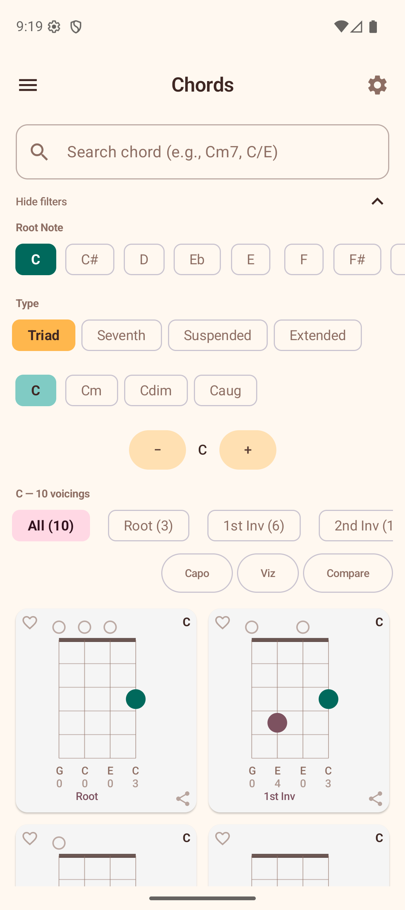

# Chords

The Chords section is a comprehensive chord library. Browse voicings for any chord by selecting a root note and chord type.

## Browsing Chords

1. **Select a root note** — tap one of the 12 note buttons at the top (C, C#, D, etc.). If you prefer flat names, you can switch this in [Settings](08-settings.md).
2. **Select a category** — choose from Triad, Seventh, Suspended, or Extended.
3. **Select a chord type** — for example, Major, Minor, Dom7, Min7, etc.

The app displays all available voicings as mini fretboard diagrams in a grid.

## Voicing Diagrams

Each voicing card shows:

- **Chord name** — displayed in bold at the top-right corner (e.g., "C", "Am").
- **Fret diagram** — a mini fretboard showing finger positions, open strings, and muted strings.
- **Note names** — the notes for each string shown below the diagram (e.g., G C E C).
- **Fret numbers** — the fret number for each string aligned below the note names (e.g., 0 0 0 3).
- **Inversion label** — Root, 1st Inv, 2nd Inv, etc.
- **Favorite icon** — a heart at the top-left to save/remove from favorites.
- **Share icon** — a share button at the bottom-right to export the voicing as an image.

**Tap** a voicing to load it onto the Explorer fretboard, where you can see it in full size.

## Inversion Filters

Above the voicing grid, filter chips let you narrow voicings by inversion type:

- **All** — shows every voicing with a count (e.g., "All (15)").
- **Root**, **1st Inv**, **2nd Inv**, **3rd Inv** — each shows how many voicings match.

Additional action buttons:

- **Capo** — opens the capo calculator to find equivalent voicings with a capo.
- **Viz** — opens the capo visualizer.
- **Compare** — groups voicings by inversion for side-by-side comparison.

## Saving Favorites

Tap the **heart icon** on any voicing card to save it to your Favorites. A filled heart indicates a saved voicing. Tap again to remove it.

See [Favorites](06-favorites.md) for more about managing your saved voicings.

## Accessibility

- **Per-string exploration** — When using TalkBack, chord diagrams provide custom actions ("Next string" / "Previous string") that announce each string's note, fret, and role (bass note, common tone) individually.
- **Share hint** — Long-pressing a chord diagram to share is announced with an accessibility hint so screen reader users know the action is available.

## Sharing Voicings

Tap the **share icon** on any voicing card to export it as an image you can send to others. You can also **long-press** a chord diagram to share it directly.

## Playing Voicings

Tap the **play button** on any voicing to hear it played back. The app strums the notes with the sound settings you have configured (volume, strum delay, note duration).

You can also play all voicings in sequence by using the play controls at the top of the voicing grid.
