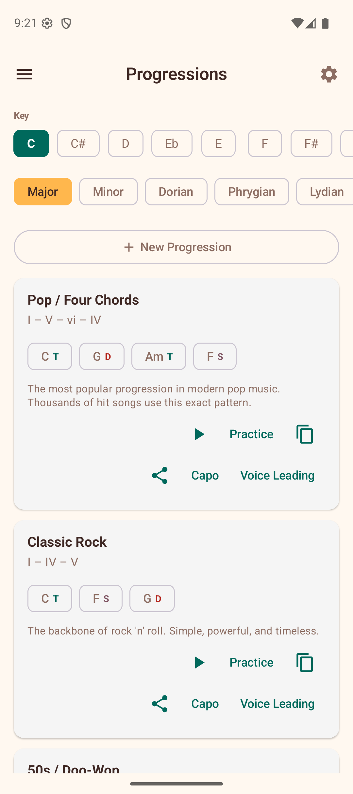

# Progressions

The Progressions section shows common chord progressions for any key across seven modes (Major, Minor, Dorian, Phrygian, Lydian, Mixolydian, and Locrian).

## Browsing Progressions

1. **Select a key** — choose a root note at the top.
2. **Choose a mode** — select from Major, Minor, Dorian, Phrygian, Lydian, Mixolydian, or Locrian. Each mode generates progressions using its own set of diatonic chords.

The app displays a list of common progressions for that key and mode: Pop (I-V-vi-IV), Classic Rock (I-IV-V), 50s (I-vi-IV-V), Folk, Jazz ii-V-I, Reggae, and more. Custom progressions appear under "My Progressions" above the "Presets" section.

## Progression Cards

Each progression card shows all of its information inline:

- **Name** — the progression name (e.g., "Pop", "Jazz ii-V-I"). Custom progressions also have a delete button in the title row.
- **Roman numeral degrees** — the scale degrees used (e.g., I – V – vi – IV).
- **Chord chips with harmonic function** — the actual chord names in your selected key, each labelled with its harmonic function: **Tonic** (primary colour), **Subdominant** (tertiary colour), or **Dominant** (red). Tap any chip to jump to its voicings in the Chord Library.
- **Description** — a short summary of where and how the progression is commonly used.

### Actions on Each Card

Actions are organised in two rows at the bottom of the card:

**Row 1 — primary actions:**

- **Play** — hear the progression played back with the current sound settings.
- **Practice** — enter practice mode where chords advance automatically on the beat.
- **Duplicate** — create a copy as a new custom progression with "(Copy)" appended to the name.
- **Edit** — open the progression in the editor to rename it, add or remove chords, or change the mode. Available on custom progressions only (presets cannot be modified).

**Row 2 — secondary actions:**

- **Share** — export the progression as text to share with others.
- **Copy** — copy the progression to the clipboard with a single tap.
- **Capo** — view capo positions that let you play the progression using simpler chord shapes.
- **Voice Leading** — view smooth voice-leading suggestions between the chords.

## BPM and Tap Tempo

The progression playback bar includes a BPM slider to control the playback speed. Next to the slider is a **Tap Tempo** button — tap it rhythmically to set the BPM by feel. The app calculates the tempo from the intervals between your taps. After 3 seconds of inactivity, the taps reset so you can start fresh.

## Custom Progressions

You can create your own custom progressions by tapping the **New Progression** button. Custom progressions can be edited, duplicated, and deleted.

When creating or editing a custom progression, diatonic chord chips for the selected scale are displayed as suggestions. These chips show the chords that naturally fit the key, making it easy to build harmonically coherent progressions without memorising music theory.

- **Edit** lets you change the name, chord sequence, or mode of an existing custom progression.
- **Duplicate** creates a new independent copy you can modify separately.
- **Delete** (trash icon on the card title row) permanently removes the custom progression after a confirmation dialog.

## Tips

- Use progressions as a starting point for songwriting or practice sessions.
- The harmonic function labels help you understand why certain chord movements sound pleasing — Tonic feels like home, Dominant creates tension, and Subdominant provides motion.
- Tap chord chips to quickly look up voicings you are not familiar with.
- Try the same progression in different keys to understand how transposition works.
- Use tap tempo when following along with a song to match its speed.
