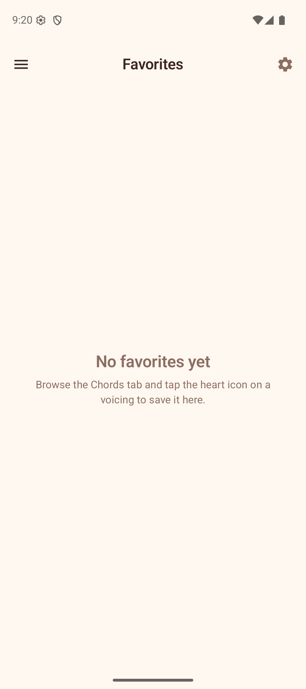

# Favorites

The Favorites section stores your saved chord voicings for quick access. You can organize them into folders for better management.

## Saving a Favorite

To save a voicing to your favorites:

1. Go to the **Chords** section.
2. Find a voicing you like.
3. Tap the **heart icon** on the voicing card — a filled heart confirms it has been saved. Tap again to remove it.

(Long-pressing a voicing diagram in the library opens the **share** action rather than saving it.)

## Viewing Favorites

Open the **Favorites** section from the navigation drawer. Your saved voicings appear in a grid, showing the chord name and a mini fretboard diagram for each.

- **Tap** a voicing to load it onto the Explorer fretboard.
- Tap the **heart icon** on a voicing to remove it from favorites.

## Organizing with Folders

Favorites can be organized into folders using the **filter chips** at the top of the screen:

- **All** — shows every saved voicing with a count (default).
- **Your folders** — each folder you create appears as a chip with the count of voicings inside.

### Creating a Folder

1. Tap the **+ chip** at the end of the filter row.
2. Enter a folder name in the dialog.
3. Tap **Create**.

The new folder appears as a chip in the filter row.

### Assigning Voicings to Folders

1. Tap the **folder icon** on any voicing.
2. A bottom sheet titled "Save to Folders" (or "Manage Folders") appears listing all your folders, each with a checkbox.
3. Tick or untick the checkboxes to add or remove the voicing from folders. A voicing can belong to more than one folder. You can also create a new folder from this sheet, or remove the voicing from favorites entirely.

### Deleting a Folder

Tap the **delete icon** on a folder chip. The folder is removed and any voicings it contained are simply unassigned from it. The voicings themselves remain in your favorites.

## Tips

- Use folders to group voicings by song, practice session, or chord type.
- A voicing can live in several folders at once — tick as many as you like in the folder sheet.
- The "All" chip always shows your complete collection regardless of folder assignments.
- Removing a voicing from favorites (via the heart icon) deletes it entirely, while removing it from a folder keeps it saved.
