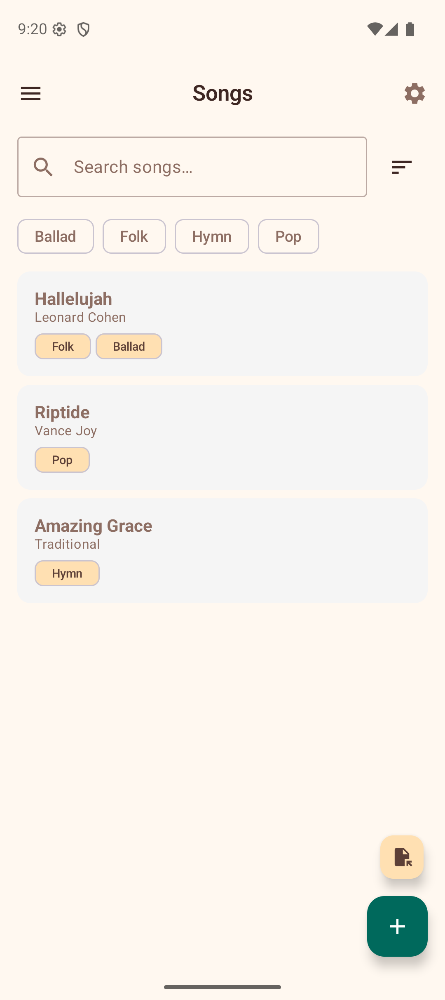

# Songs

The Songs section is your personal songbook. Create chord sheets with lyrics and inline chord markers, then use them as a reference while playing. Search, sort, and label your songs to keep a growing collection organised.



## Search and Sort

The song list includes a **search bar** and a **sort menu** to help you find songs quickly:

- **Search** — type any part of a title, artist, or content to filter the list in real time. Tap the clear button to reset.
- **Sort** — tap the sort icon to choose an ordering: Last Modified, Date Added, Title, or Artist.

## Labels

Labels let you categorise songs (e.g., "Beginner", "Jazz", "Campfire") and filter the list by category.

- **On song cards** — each song displays its labels as small tappable chips. Tap a label chip to filter the list to songs with that label.
- **Label filter bar** — when labels exist, filter chips appear below the search bar. Tap a chip to toggle it; tap "Clear" to remove the filter.
- **Adding labels** — in the song editor, the label editor section lets you type a new label or pick from existing ones with auto-suggest. Tap the **+** icon to confirm. Labels appear as removable chips you can tap to delete.
- **In the viewer** — labels are shown below the key detection row. Tap the **+** chip to add a label without entering the editor.

## Creating a Chord Sheet

1. Tap the **+ button** to create a new song.
2. Enter a **title** and optionally an **artist**.
3. Choose a **strum pattern** to associate with the song (see below).
4. Add **labels** to categorise the song.
5. In the content area, type your lyrics with chord markers using square bracket notation:

   ```
   Some[C]where over the [Em]rainbow
   [F]Way up [C]high
   ```

6. Use the **chord insertion chips** (C, G, Am, F, Em, Dm, D, A, E, Bm) above the text field to quickly insert common chords at the cursor.
7. Switch between the **Edit** and **Preview** tabs to see how chords render above the lyrics in real time.
8. Tap **Save** to add the song to your collection. If you try to leave with unsaved changes, a confirmation dialog appears.

## Importing Songs

You can import chord sheets from files on your device:

1. Tap the **import button** (file icon) at the bottom of the songs list.
2. Select a file from your device. The app supports:
   - **ChordPro files** (`.chopro`, `.cho`, `.chordpro`) — parsed automatically with title, artist, and chord directives.
   - **Plain text files** — imported as-is with the filename used as the title.
3. The imported song is added to your collection immediately.

## Viewing a Chord Sheet

Tap any song in the list to open it. The viewer renders your text with chords displayed on a separate line above the lyrics, aligned with each word.

**Tap any chord name** in the viewer to jump directly to its voicings in the Chord Library. This makes it easy to look up unfamiliar chords while practicing a song.

### Key Detection

The app automatically analyses the chords in your song and displays the **detected key** (e.g., "Key: C Major") at the top of the viewer. This uses a simplified Krumhansl–Schmuckler algorithm to determine the best-fitting key.

### Strum Pattern

Below the key, the viewer shows the **associated strum pattern** with its notation (e.g., "Island Strum: D DU UDU"). You can change the pattern or remove it directly from the viewer without entering the editor.

## Auto-Scroll

The song viewer includes an **auto-scroll** feature so you can keep both hands on your ukulele while reading lyrics:

1. Tap the **play button** (floating action button) in the bottom-right corner to start auto-scrolling.
2. While scrolling, **speed controls** appear as chips: **0.5x**, **1x**, **2x**, and **3x**. Tap a chip to change the scroll speed.
3. Tap the **pause button** to pause auto-scrolling temporarily.
4. Tap the **stop button** to stop auto-scrolling and reset to the top.
5. If you manually scroll or swipe the screen while auto-scroll is active, it pauses automatically.

This is especially useful during practice or performance when you cannot tap the screen to scroll manually.

## Transposing Songs

The song viewer includes **transpose controls** to shift all chords up or down by semitones. This is helpful when a song is in a key that does not suit your voice or playing style. The original text is preserved — only the displayed chord names change.

When a transposition is active, the app also displays an equivalent **capo suggestion**. For example, if you transpose up 5 semitones, the app shows "Or use Capo 5 with original chords" — so you can choose whichever approach you prefer.

### Save in This Key

If you want to keep the transposed version permanently, tap **Save in this key**. This rewrites the chord sheet with the new chord names and updates the stored key. The original chords are replaced — use this when you have found the right key and want to commit to it.

## Exporting and Sharing

Tap the **share button** in the song viewer to open the export format picker. Choose one of three options:

- **ChordPro (.cho)** — generates a ChordPro-formatted file with proper directives (`{title:}`, `{artist:}`, section markers) for use in other chord sheet apps.
- **Plain text** — sends the chord sheet as formatted text with chords displayed above lyrics, ready to share via any messaging or sharing app.
- **Copy to clipboard** — copies the formatted chord sheet to the clipboard for quick pasting into messages, notes, or other apps.

If a transposition is active, the exported or copied content uses the transposed chords automatically.

## Editing and Deleting

- Tap a song in the list to open the viewer, then tap the **edit button** (pencil icon) in the toolbar to modify the title, artist, strum pattern, labels, or content.
- Tap the **delete button** (trash icon) in the toolbar to remove a song. A confirmation dialog asks you to confirm before the song is permanently deleted.
- If you have unsaved changes in the editor and try to cancel, a **discard changes** dialog appears so you do not lose work accidentally.

## Tips

- Use the `[ChordName]` bracket notation to mark chords anywhere in your lyrics.
- Use the chord insertion chips in the editor to speed up chord entry.
- Switch to Preview mode while editing to check chord alignment before saving.
- Auto-scroll at 0.5x or 1x speed is good for slow ballads; try 2x or 3x for faster songs.
- Import ChordPro files from other apps or websites to quickly build your songbook.
- The capo suggestion makes transposition practical — you can see the easy chord shapes at a glance.
- Label songs by genre, difficulty, or occasion to find them quickly as your collection grows.
