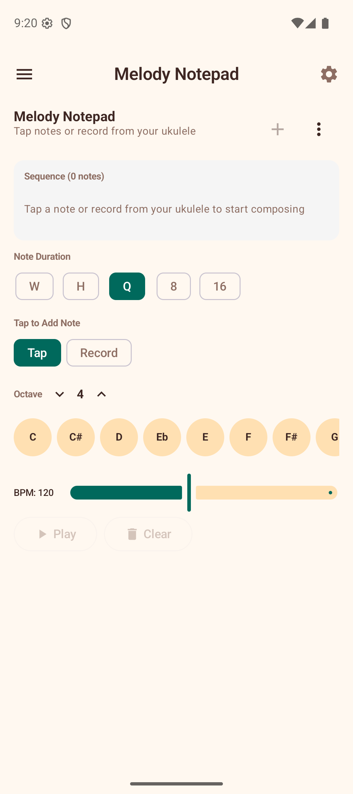

# Melody Notepad

The Melody Notepad is a melody composer and sequencer with two input modes — **Linear** (tap or record notes one at a time) and **Step Sequencer** (fill a grid of 8 or 16 steps). Create melodies, loops, and rhythmic patterns, then play them back at any tempo.

## Creating a Melody

### Tap Mode

1. Select a **note duration** (Whole, Half, Quarter, Eighth, or Sixteenth) using the duration chips.
2. Choose the **octave** (3-6) using the up/down arrows.
3. Tap any of the 12 note buttons (C through B) to add a note to the sequence.
4. Tap the **Rest** button to insert a rest of the selected duration.

Notes appear in the sequence display at the top as colored blocks showing the note name and duration.

### Record Mode

1. Tap **Record** to switch to recording mode.
2. Tap the microphone button to start listening.
3. Play a note on your ukulele — the app detects the pitch and adds it to the sequence once the note stabilizes.
4. Continue playing notes to build the melody.
5. Tap stop when finished.

### Step Sequencer Mode

Toggle from Linear to **Step Sequencer** mode using the mode switch at the top.

1. The sequencer shows a grid of **8 steps** by default. Tap the **16 steps** button to switch to a 16-step grid; it then becomes an **8 steps** button to return to 8.
2. Tap any step in the grid to open a **pitch picker**. Select a note name and octave to assign it to that step.
3. Long-press a step to **clear** it (reset it to silence).
4. Tap **Play** to loop the sequence continuously at the current BPM. The active step is highlighted as it plays.
5. Tap **Stop** to end playback.

The step sequencer is ideal for building rhythmic patterns and loop-based ideas without worrying about note durations — each step has equal timing determined by the BPM.

## Editing

- Tap any note in the sequence to select it. The selected note is highlighted.
- Tap the **delete** icon to remove the selected note.
- The sequence scrolls horizontally if it extends beyond the screen width.

## Playback

- Set the **BPM** using the slider (40-220 BPM).
- Tap **Play** to hear the melody played back. The current note is highlighted during playback.
- Tap **Stop** to halt playback.
- Tap **Clear** to remove all notes from the sequence.

## Saving and Loading

Melodies are saved to the device and persist between sessions.

- Tap the **save** icon or use the menu to **Save As** with a custom name.
- Use **Load** to open a previously saved melody from a list.
- Use **Rename** to change the name of the current melody.
- Use **New** to start a fresh empty melody (you will be prompted to save unsaved changes).
- Use **Delete** to permanently remove the current melody.

## Tips

- Use Tap mode for precise control over note placement and duration.
- Use Record mode to quickly capture a melody idea by playing it on your ukulele.
- Use Step Sequencer mode for rhythmic patterns and loop-based ideas — great for experimenting with riffs.
- Start with quarter notes for simple melodies, then add eighth and sixteenth notes for faster passages.
- Experiment with different octaves to create melodies that span the full ukulele range.
- In Record mode, if the app picks up unwanted notes from background noise, increase the **Noise filtering** slider in Settings.
- In the step sequencer, start with 8 steps for short loops and expand to 16 when you need a longer phrase.
