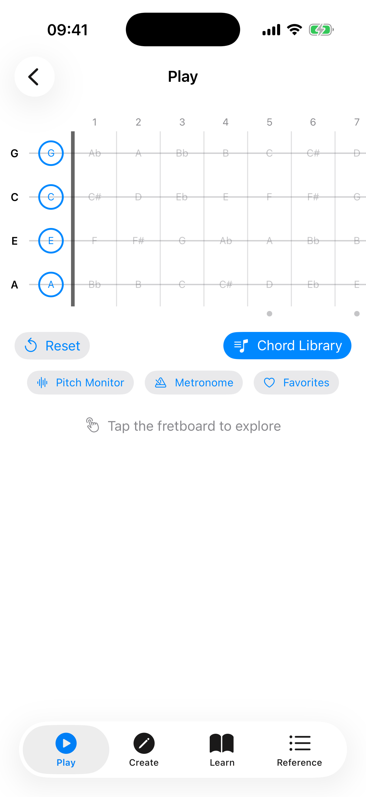
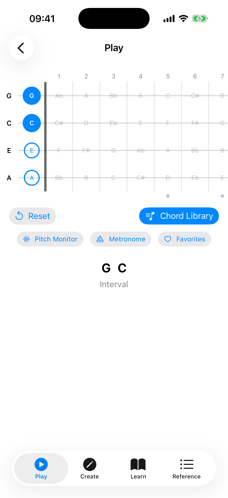
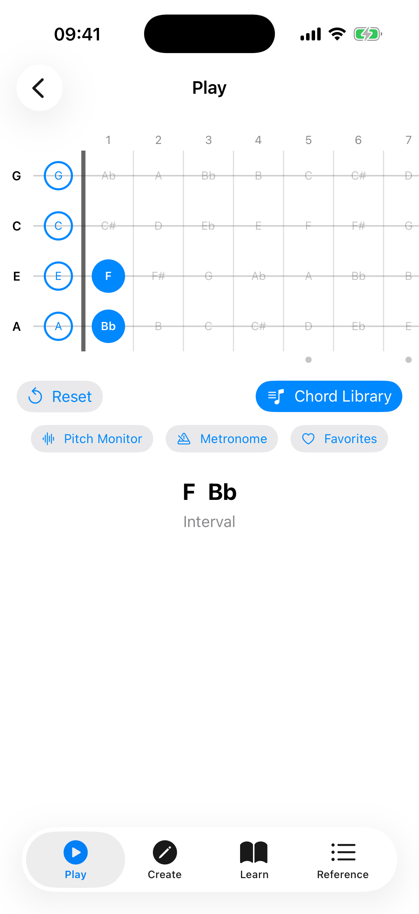

# Explorer

The Explorer is the main screen of Ukulele Companion. It shows an interactive fretboard where you can tap fret positions and the app instantly detects and displays the chord you are playing.

## Suggested Chords

When no frets are selected, the area below the fretboard shows a **"Try These"** section with a row of common ukulele chords: **C**, **Am**, **F**, **G7**, **Em**, and **D**. Tap any chip to load the chord onto the fretboard instantly. This is a quick way to hear what the chords sound like and see the fingering. Tap **Reset** (in the action bar above) to clear the fretboard and see the suggestions again.

## Tapping Notes

Tap any fret cell on the fretboard to place or remove a finger. The fretboard displays frets 0 through 12 across four strings (G, C, E, A in standard tuning).

As you tap frets, the app analyzes the selected notes and shows the detected chord name above the fretboard. The app recognizes 19 chord types across four categories:

- **Triads** — Major, Minor, Diminished, Augmented
- **Seventh** — Dom7, Min7, Maj7, Aug7, Dim7, Half-Diminished (m7♭5), Minor Major 7th
- **Suspended** — Sus2, Sus4, 7sus4
- **Extended** — 6, Min6, 9, Min9, Add9

### Chord Detail Info

When a chord is detected, the area below the fretboard shows detailed information:

- **Chord name** — with slash notation for inversions (e.g., C/E).
- **Quality** — e.g., "Major", "Minor 7th (1st Inv)".
- **Also written as** — alternate notational symbols used in different musical traditions. For example, detecting "Cdim" also shows "C°", and "Cmaj7" also shows "CM7, CΔ7, C^7". This helps you recognize the same chord written in different styles across books, apps, and sheet music.
- **Also** chips — when the same set of notes can form a different chord (e.g., Am7 and C6 share the same notes), the alternates appear as chips. Tap one to look it up in the Chord Library.
- **Intervals, Formula, Fingering, Difficulty, Inversion** — detailed music theory breakdown.

Below the chord name, a **Play** button strums the chord and a **Share** button exports it as an image. Tapping the chord name itself opens the voicing in the Chord Library.

## Scale Overlay

The scale overlay highlights notes from a selected scale directly on the fretboard. This is helpful for understanding which notes fit within a key while you explore chords.

To use the scale overlay:

1. Tap the **Scales** button (in the action bar above the capo slider) to reveal the scale panel.
2. Turn on the **Scale Overlay** toggle.
3. Select a **root note** (e.g., C, G, D).
4. Select a **scale type**. A wide range of scales is available — including Major, Natural Minor, Harmonic Minor, Melodic Minor, the pentatonic and blues scales, the church modes (Dorian, Phrygian, Lydian, Mixolydian, Locrian), and many more.

Scale notes are highlighted on the fretboard, with the root note shown in a distinct color.

### Scale Positions

When a scale is active, a row of **Position** chips appears. These let you focus on a specific fret range:

- **All** — shows all scale notes across the entire fretboard (default).
- **Position 1, 2, 3...** — limits the highlighted notes to a specific fret range, making it easier to practice one position at a time.

Tap a position chip to filter, and tap **All** to go back to showing every note.

### Key-Aware Note Spelling

When a scale overlay is active, the fretboard automatically uses the correct note spelling for that key. For example, in the key of F major, the note between A and B is shown as "Bb" (flat), while in the key of G major, the note between F and G is shown as "F#" (sharp). This follows standard music theory conventions.

### Chords in Scale

Below the position chips, the app lists the **chords that naturally occur** in the selected scale (the diatonic triads), each labelled with its Roman-numeral scale degree. This gives you a quick reference for which chords fit the key you are exploring.

## Did You Know?

When no frets are selected, the Explorer shows a rotating **"Did you know?"** card with tips about ukulele history, music theory, chord notation, and practice techniques. Tap **Next tip** to see another one. These tips cover topics like:

- Ukulele facts and history (origins, tuning, famous players).
- Music theory nuggets (intervals, chord construction, the Circle of Fifths).
- Chord notation conventions (what symbols like °, +, and Δ7 mean).
- Practice advice (using a metronome, fingerpicking, recording yourself).

## Sound Playback

If sound is enabled in Settings, the app plays back the notes when you tap the fretboard. You can also tap the **Play** button to hear the current chord strummed. See [Settings](08-settings.md) for sound options.

## Full-Screen Mode

Tap the **full-screen icon** in the top-right corner to expand the fretboard to fill the entire screen, hiding the top bar and other controls.
