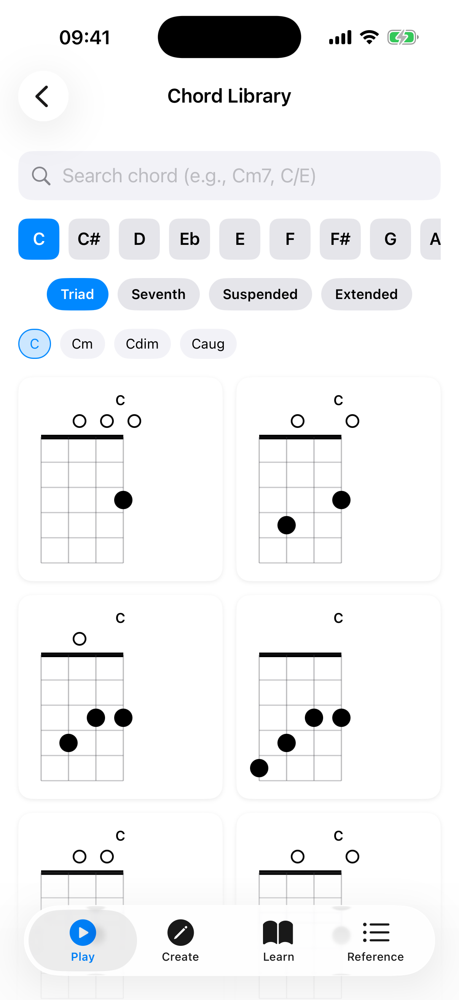

# Chord Library

The Chord Library is a comprehensive collection of chord voicings. Browse voicings for any chord by selecting a root note and chord type.

## Browsing Chords

The filter controls are grouped under a collapsible **Filters** header (tap it to expand or collapse). With the filters expanded:

1. **Select a root note** — tap one of the 12 note buttons (C, C#, D, etc.). If you prefer flat names, you can switch this in [Settings](08-settings.md).
2. **Transpose** — optional **+** and **−** buttons shift the selected root up or down by semitones.
3. **Select a category** — choose from Triad, Seventh, Suspended, or Extended.
4. **Select a chord type** — for example, Major, Minor, Dom7, Min7, etc.

The app displays all available voicings as mini fretboard diagrams in a grid.

You can also use the **search bar** at the top to find a chord directly by name (for example, "Cm7" or "C/E").

## Voicing Diagrams

Each voicing card shows:

- **Chord name** — displayed at the top of the card (e.g., "C", "Am").
- **Fret diagram** — a vertical mini fretboard showing finger positions, open strings, and muted strings, with a position marker (e.g., "3fr") when the voicing is higher up the neck.
- **Favorite button** — a heart at the bottom-left to save or manage the voicing in your favorites.
- **Share button** — a share icon at the bottom-right to export the voicing as an image.

**Tap** a voicing diagram to load it onto the Explorer fretboard (and hear it played).

## Inversion Filters

When a chord type is selected, an **Inversions** row appears above the voicing grid with filter chips:

- **All** — shows every voicing with a count (e.g., "All (15)").
- **Root**, **1st Inv**, **2nd Inv**, **3rd Inv** — each shows how many voicings match. Only inversions that have voicings are listed.

When more than one voicing is shown, a **Play all** button in the Inversions row plays the filtered voicings in sequence.

## Capo Tools

**Long-press** any voicing card to open its context menu, which offers:

- **Share as Image** — export the voicing as an image.
- **Capo Positions** — open the capo calculator to find equivalent voicings with a capo.
- **Capo Visualizer** — open the capo visualizer for that voicing.

## Saving Favorites

Tap the **heart icon** on any voicing card to open the favorites sheet. From there you can save the voicing, add it to one or more folders, or remove it. A filled red heart indicates a saved voicing.

See [Favorites](06-favorites.md) for more about managing your saved voicings.

## Accessibility

- **Per-string exploration** — When using VoiceOver, chord diagrams provide per-string details (note, fret, and role such as bass note or common tone) accessible through the VoiceOver rotor's custom content.
- **Share hint** — The chord diagram announces a hint that it can be long-pressed to share as an image.

## Sharing Voicings

Tap the **share icon** on any voicing card to export it as an image you can send to others. You can also **long-press** a chord diagram and choose **Share as Image** from its context menu.

## Playing Voicings

Tapping a voicing diagram loads it onto the Explorer fretboard and plays it back, strummed with the sound settings you have configured (volume, strum delay, note duration). When a chord type shows more than one voicing, use **Play all** in the Inversions row to hear them in sequence.
