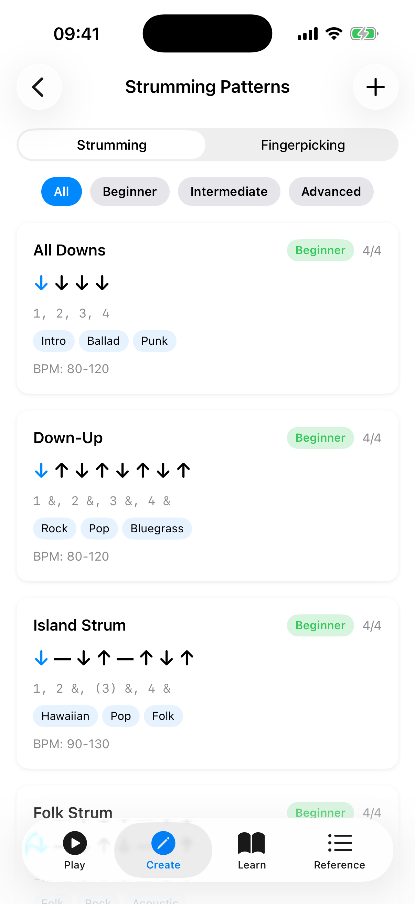

# Patterns

The Patterns section provides a reference guide for strumming and fingerpicking patterns with audio playback. Use the toggle chips at the top to switch between the two views.

## Strumming Patterns

The **Strumming** tab shows a list of preset strumming patterns, from beginner to advanced. Each pattern card includes:

- **Name** — e.g., "Island Strum", "Calypso", "6/8 Ballad".
- **Time signature badge** — shows the time signature the pattern is designed for (e.g., 4/4, 3/4, 6/8).
- **Difficulty badge** — Beginner, Intermediate, or Advanced.
- **Visual beat arrows** — down arrows, up arrows, chuck (X), and miss/pause indicators showing the rhythmic pattern. The active beat is highlighted during playback.
- **Counting** — a text representation of the rhythm count.
- **Genre tags** — musical styles the pattern suits (e.g., Hawaiian, Pop, Folk).
- **Play button** — tap the play icon to hear the pattern played on open strings. The currently active beat highlights as it plays. Tap the stop icon to stop playback. Only one pattern plays at a time.
- **BPM slider** — adjust the playback tempo (40–220 BPM).

Tap a card to expand it and reveal the pattern's **description** and **notation** (e.g., "D - D U - U D U"). To copy a preset into your own patterns, **long-press** the card and choose **Duplicate** — the copy appears in "My Patterns" with " (Copy)" appended to the name.

### Managing Custom Patterns

Tap the **+ button** in the top-right of the toolbar to create your own strumming pattern. The editor is a form:

1. Enter a **pattern name**.
2. Select a **time signature** — 4/4, 3/4, or 6/8.
3. In the **Beats** section, tap **Add Beat** to append beats. Each beat row has a **direction** picker (Down, Up, Chuck, Miss, or Pause) and an **Accent** toggle. Swipe a beat row to delete it.
4. Tap **Save** to add it to your custom patterns.

Your custom patterns appear in a **"My Patterns"** section at the top of the list. Custom patterns have additional actions, available as buttons on the card or from its long-press menu:

- **Edit** — tap the pencil icon to open the pattern in the editor with all fields pre-populated for modification.
- **Duplicate** — tap the copy icon to create a copy you can then edit independently.
- **Delete** — tap the trash icon. A confirmation appears before the pattern is permanently removed.

## Fingerpicking Patterns

The **Fingerpicking** tab shows reference patterns for fingerstyle playing, including patterns in 4/4, 3/4, and 6/8 time. Each card includes:

- **Name** — e.g., "Arpeggio Up", "Travis Pick", "6/8 Arpeggio", "Clawhammer".
- **Time signature badge** — shows the time signature (e.g., 4/4, 3/4, 6/8).
- **Difficulty badge** — Beginner or Intermediate.
- **Finger step display** — indicators showing which finger (Thumb, Index, Middle, Ring) plucks which string (G, C, E, A) at each step. The active step is highlighted during playback.
- **Play button** — tap to hear each note plucked in sequence on the open strings. The active step highlights during playback.
- **BPM slider** — adjust the playback tempo.

Tap a card to expand it for the pattern's **description** and **notation** (e.g., "T(G) T(C) I(E) M(A)"). To copy a preset, **long-press** the card and choose **Duplicate**.

### Creating Custom Fingerpicking Patterns

Tap the **+ button** in the toolbar on the Fingerpicking tab to create your own pattern. The editor is a form:

1. Enter a **pattern name**.
2. Select a **time signature** — 4/4, 3/4, or 6/8.
3. In the **Steps** section, tap **Add Step** to append steps. Each step row has a **finger** picker (T, I, M, R), a **string** picker (G, C, E, A), and an **Accent** toggle. Swipe a step row to delete it.
4. Tap **Save** to add it to your custom patterns.

Custom fingerpicking patterns support the same **edit**, **duplicate**, and **delete** actions as custom strumming patterns.

## Tips

- Start with the beginner patterns and work your way up.
- Use the **play button** to hear each pattern — listening is much more effective than reading notation alone.
- Adjust the **BPM slider** to start slow and gradually increase speed as you get comfortable.
- Playback uses the open strings of your selected tuning, so it matches whatever tuning you have configured in Settings.
- Long-press a preset to **Duplicate** it into "My Patterns", then **edit** the copy to create your own variation.
- The time signature badge helps you match patterns to songs — most pop/rock is 4/4, waltzes are 3/4, and ballads like "House of the Rising Sun" are 6/8.
