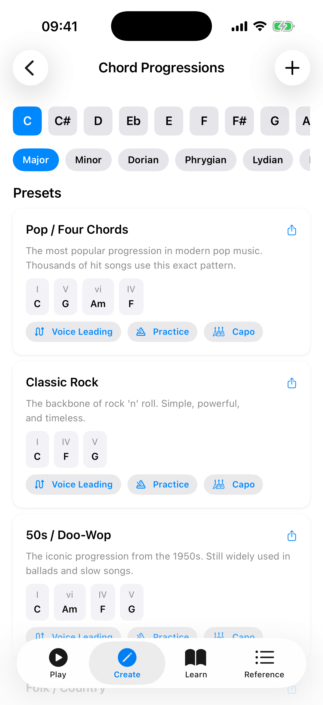

# Progressions

The Progressions section shows common chord progressions for any key across seven modes (Major, Minor, Dorian, Phrygian, Lydian, Mixolydian, and Locrian).

## Browsing Progressions

1. **Select a key** — choose a root note at the top.
2. **Choose a mode** — select from Major, Minor, Dorian, Phrygian, Lydian, Mixolydian, or Locrian. Each mode generates progressions using its own set of diatonic chords.

The app displays a list of common progressions for that key and mode: Pop (I-V-vi-IV), Classic Rock (I-IV-V), 50s (I-vi-IV-V), Folk, Jazz ii-V-I, Reggae, and more. Any progressions you create appear under a "Custom" section above the "Presets" section.

## Progression Cards

Each progression card shows all of its information inline:

- **Title row** — the progression name (e.g., "Pop", "Jazz ii-V-I") with **Share** and **Copy** icons. Custom progressions also show **Edit** (pencil) and **Delete** (trash) icons here.
- **Description** — a short summary of where and how the progression is commonly used.
- **Chord chips** — each chip shows the Roman-numeral degree (e.g., I, V, vi, IV), the actual chord name in your selected key, and the chord's harmonic function: **Tonic**, **Subdominant**, or **Dominant** (each shown in a distinct colour). The chip for the current chord is highlighted during playback.
- **Playback bar** — a Play button, BPM control, a Beats-per-chord selector, and a loop toggle.

### Actions on Each Card

- **Play** (in the playback bar) — hear the progression played back with the current sound settings.
- **Beats per chord** (in the playback bar) — choose 1, 2, 4, or 8 beats before advancing.
- **Loop** (in the playback bar) — repeat the progression continuously.
- **Voice Leading** — view smooth voice-leading suggestions between the chords.
- **Practice** — open practice mode where chords advance automatically on the beat.
- **Capo** — view capo positions that let you play the progression using simpler chord shapes.
- **Share** / **Copy** (title-row icons) — export the progression as text, or copy it to the clipboard.
- **Edit** / **Delete** (title-row icons, custom progressions only) — modify or remove a custom progression.
- **Duplicate** — long-press the card and choose **Duplicate** to create a copy as a new custom progression with "(Copy)" appended to the name.

## Custom Progressions

You can create your own custom progressions by tapping the **+** button in the toolbar. Custom progressions can be edited, duplicated, and deleted.

When creating or editing a custom progression, diatonic chord chips for the selected scale are displayed as suggestions. These chips show the chords that naturally fit the key, making it easy to build harmonically coherent progressions without memorising music theory.

- **Edit** (pencil icon) lets you change the name, chord sequence, or mode of an existing custom progression.
- **Duplicate** (long-press menu) creates a new independent copy you can modify separately.
- **Delete** (trash icon on the card title row) permanently removes the custom progression after a confirmation dialog.

## Tips

- Use progressions as a starting point for songwriting or practice sessions.
- The harmonic function labels help you understand why certain chord movements sound pleasing — Tonic feels like home, Dominant creates tension, and Subdominant provides motion.
- Use the **Practice** button to run a progression in time and rehearse the chord changes.
- Try the same progression in different keys to understand how transposition works.
- Use the **Capo** view to find simpler shapes for awkward keys.
