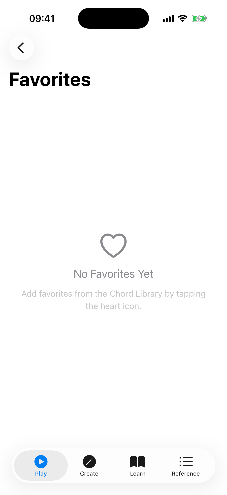

# Favorites

The Favorites section stores your saved chord voicings for quick access. You can organize them into folders for better management.

## Saving a Favorite

To save a voicing to your favorites:

1. Go to the **Chord Library** section.
2. Find a voicing you like.
3. Tap the **heart icon** on the voicing card to open the favorites sheet, then tap **Save** (optionally choosing one or more folders first).

A filled red heart on a voicing card means it is saved.

## Viewing Favorites

Open the **Favorites** section from the Play tab. Your saved voicings appear in a grid, showing the chord name and a mini fretboard diagram for each. When you have no favorites yet, the screen shows a short prompt explaining how to add them.

Each favorite card has a few controls:

- **Tap the diagram** to hear the chord played back.
- **Folder icon** — open the favorites sheet to move the voicing between folders.
- **Speaker icon** — play the chord.
- **Share icon** — export the voicing as an image.
- **Heart icon** — remove the voicing from favorites.

## Organizing with Folders

Favorites can be organized into folders using the **filter chips** at the top of the screen:

- **All** — shows every saved voicing (default), with a count.
- **Your folders** — each folder you create appears as a chip with the count of voicings inside.

### Creating a Folder

1. Tap the **+ chip** at the end of the filter row.
2. Enter a folder name in the dialog.
3. Tap **Create**.

The new folder appears as a chip in the filter row. (You can also create a folder from the favorites sheet while saving a voicing.)

### Moving Voicings to a Folder

1. Tap the **folder icon** on any favorite card.
2. A sheet appears listing all your folders with checkmarks.
3. Tap folders to select or deselect them, then tap **Save**. A voicing can belong to more than one folder.

### Managing a Folder

Tap a folder chip to open its menu, which offers **View**, **Rename**, and **Delete**. Deleting a folder removes the folder only — the voicings inside remain in your favorites.

### Reordering Within a Folder

When viewing a single folder, tap the reorder button in the toolbar to drag voicings into the order you prefer.

## Tips

- Use folders to group voicings by song, practice session, or chord type.
- The "All" chip always shows your complete collection regardless of folder assignments.
- Removing a voicing with the heart icon deletes it from favorites entirely; removing it from a folder (by deselecting the folder in the sheet) keeps it saved.
