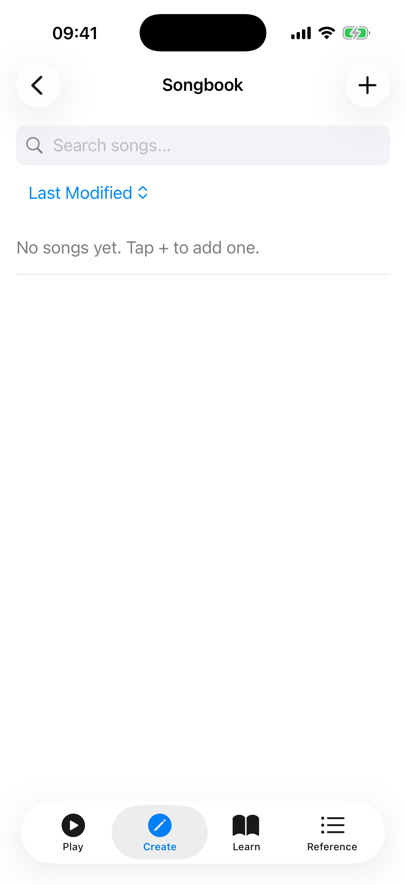

# Songs

The Songs section is your personal songbook. Create chord sheets with lyrics and inline chord markers, then use them as a reference while playing. Search, sort, label, and batch-manage your songs. Organise them into setlists for gigs, and use Performance Mode for hands-free, full-screen viewing.



## Search and Sort

The song list includes a **search bar** and a **sort menu** to help you find songs quickly:

- **Search** — type any part of a title, artist, or content to filter the list in real time. Tap the clear button to reset.
- **Sort** — tap the sort icon to choose an ordering: Last Modified, Date Added, Title, or Artist.

## Labels

Labels let you categorise songs (e.g., "Beginner", "Jazz", "Campfire") and filter the list by category.

- **On song cards** — each song displays its labels as small tappable chips. Tap a label chip to filter the list to songs with that label.
- **Label filter bar** — when labels exist, filter chips appear below the search bar. Tap a chip to toggle it; tap "Clear" to remove the filter.
- **Adding labels** — in the song editor, the label editor section lets you type a new label or pick from existing ones with auto-suggest. Tap the **+** icon to confirm. Labels appear as removable chips you can tap to delete.
- **In the viewer** — labels are shown below the key detection row. Tap the **+** chip to add a label without entering the editor.

## Creating a Chord Sheet

1. Tap the **+ button** to create a new song.
2. Enter a **title** and optionally an **artist** and **subtitle**.
3. Choose a **strum pattern** to associate with the song (see below).
4. Add **labels** to categorise the song.
5. In the content area, type your lyrics with chord markers using square bracket notation:

   ```
   Some[C]where over the [Em]rainbow
   [F]Way up [C]high
   ```

6. Use the **chord insertion chips** (C, G, Am, F, Em, Dm, D, A, E, Bm) above the text field to quickly insert common chords at the cursor.
7. Switch between the **Edit** and **Preview** tabs to see how chords render above the lyrics in real time.
8. Tap **Save** to add the song to your collection. If you try to leave with unsaved changes, a confirmation dialog appears.

## Importing Songs

You can import chord sheets from files on your device or by pasting ChordPro text directly.

### Import from File

1. Tap the **import button** in the toolbar and choose **Import from file**.
2. Select a file from your device. The app supports:
   - **ChordPro files** (`.cho`, `.chordpro`, `.chopro`, `.crd`, `.pro`) — parsed automatically with title, artist, subtitle, and chord directives.
   - **Plain text files** — imported as-is with the filename used as the title.
3. The imported song is added to your collection immediately.

### Paste ChordPro Text

1. Tap the **import button** and choose **Paste ChordPro text**.
2. A dialog opens with a text field where you can paste ChordPro-formatted content from the clipboard.
3. Tap **Import** to parse and add the song. The title, artist, and chords are extracted automatically.

This is useful when you have ChordPro text copied from a website or message and want to import it without saving a file first.

## Viewing a Chord Sheet

Tap any song in the list to open it. The viewer renders your text with chords displayed on a separate line above the lyrics, aligned with each word.

**Tap any chord name** in the viewer to open a **chord detail panel**. The panel shows the chord name, a **chord diagram** with the voicing, a **Play** button to hear the chord, and a **View in Library** link to see all voicings for that chord. This makes it easy to look up and hear unfamiliar chords while practising a song.

### Key Detection

The app automatically analyses the chords in your song and displays the **detected key** (e.g., "Key: C Major") at the top of the viewer. This uses a simplified Krumhansl-Schmuckler algorithm to determine the best-fitting key.

### Strum Pattern

Below the key, the viewer shows the **associated strum pattern** with its notation (e.g., "Island Strum: D DU UDU"). You can change the pattern or remove it directly from the viewer without entering the editor.

### Song Statistics

Once a song has been viewed at least once, a statistics row appears showing:

- **View count** — the number of times you have opened this song.
- **Last viewed** — a relative timestamp (e.g., "5 minutes ago", "2 days ago").
- **Total viewing time** — the cumulative time spent viewing the song, displayed in a human-readable format (e.g., "12 min", "1 h 30 min").

Statistics are tracked automatically each time you open or spend time on a song.

## Section Navigation

When a song contains section markers (such as Verse, Chorus, Bridge, Intro, or Outro), **section chips** appear as a horizontally scrollable row below the song metadata. Tap any chip to **scroll directly** to that section in the viewer. This is especially useful for long songs where you need to jump to a specific part quickly.

Section markers are recognised from ChordPro directives (e.g., `{start_of_chorus}`) and from bracket-style labels (e.g., `[Chorus]`).

## Font Size Controls

The song viewer includes **font size controls** to adjust the text to your preferred reading size:

- Tap the **A-** button to decrease the font size.
- Tap the **A+** button to increase the font size.

Your chosen font size is saved automatically and persists between sessions.

## Auto-Scroll

The song viewer includes an **auto-scroll** feature so you can keep both hands on your ukulele while reading lyrics:

1. Tap the **play button** in the toolbar to start auto-scrolling.
2. While scrolling, **speed controls** appear as chips: **0.5x**, **1x**, **2x**, and **3x**. Tap a chip to change the scroll speed.
3. Tap the **pause button** to pause auto-scrolling temporarily.
4. Tap the **stop button** to stop auto-scrolling and reset to the top.
5. If you manually scroll or swipe the screen while auto-scroll is active, it pauses automatically.

This is especially useful during practice or performance when you cannot tap the screen to scroll manually.

## Performance Mode

Tap the **fullscreen button** (expand icon) in the viewer toolbar to enter Performance Mode. The song displays full-screen on a clean background with no toolbar or other controls.

- **Tap the screen** to toggle the on-screen controls: auto-scroll play/pause, speed adjustment with **-** and **+** buttons (0.5x to 5.0x in fine increments), and an exit button.
- Tap the **exit button** (collapse icon) to return to the normal viewer.

Performance Mode is ideal for live performance or practice sessions when you want maximum screen space and hands-free scrolling.

## Transposing Songs

The song viewer includes **transpose controls** to shift all chords up or down by semitones. This is helpful when a song is in a key that does not suit your voice or playing style. The original text is preserved — only the displayed chord names change.

When a transposition is active, the app also displays an equivalent **capo suggestion**. For example, if you transpose up 5 semitones, the app shows "Or use Capo 5 with original chords" — so you can choose whichever approach you prefer.

### Save in This Key

If you want to keep the transposed version permanently, tap **Save in this key**. This rewrites the chord sheet with the new chord names and updates the stored key. The original chords are replaced — use this when you have found the right key and want to commit to it.

## Exporting and Sharing

Tap the **share button** in the song viewer to open the export format picker. Choose one of four options:

- **ChordPro (.cho)** — generates a ChordPro-formatted file with proper directives (`{title:}`, `{artist:}`, section markers) for use in other chord sheet apps.
- **Plain text** — sends the chord sheet as formatted text with chords displayed above lyrics, ready to share via any messaging or sharing app.
- **PDF (.pdf)** — generates a PDF document with the song title and formatted chord sheet, suitable for printing or sharing as a file.
- **Copy to clipboard** — copies the formatted chord sheet to the clipboard for quick pasting into messages, notes, or other apps.

If a transposition is active, the exported or copied content uses the transposed chords automatically.

## Editing and Deleting

- Tap a song in the list to open the viewer, then tap the **edit button** (pencil icon) in the toolbar to modify the title, artist, subtitle, strum pattern, labels, or content.
- Tap the **duplicate button** (copy icon) in the toolbar to create a copy of the song. The duplicate is saved with "(Copy)" appended to the title.
- Tap the **delete button** (trash icon) in the toolbar to remove a song. A confirmation dialog asks you to confirm before the song is permanently deleted.
- If you have unsaved changes in the editor and try to cancel, a **discard changes** dialog appears so you do not lose work accidentally.

## Batch Operations

You can select multiple songs to perform bulk actions:

1. Tap the **Select Songs** button in the toolbar to enter selection mode.
2. Tap songs to select or deselect them — checkboxes appear on each card.
3. A selection bar shows the number of selected songs with these actions:
   - **Select All** — selects every song in the list.
   - **Delete** — bulk-deletes all selected songs (with a confirmation dialog).
   - **Cancel** — exits selection mode without making changes.

Batch operations are useful for cleaning up your songbook or removing multiple songs at once.

## Metronome Integration

If a song contains a `{tempo}` directive in its ChordPro content (e.g., `{tempo: 120}`), the viewer displays the **tempo** (e.g., "Tempo: 120 BPM") with a **Start Metronome** button. Tapping the button launches the metronome at the song's BPM automatically, so you can practise with the correct tempo without manually setting it.

## Setlists

Setlists are ordered collections of songs for organising gigs, practice sessions, or themed playlists.

### Accessing Setlists

Open the **Create** tab and tap **Setlists** to view your setlist collection.

### Creating a Setlist

1. Tap the **+ button** in the toolbar to create a new setlist.
2. Enter a **name** (e.g., "Friday Gig", "Beginner Songs") and tap **Create**.

### Adding Songs to a Setlist

1. Open a setlist by tapping it.
2. Tap the **+ button** to open the song picker.
3. Browse available songs — songs already in the setlist are excluded from the list.
4. Tap a song to add it to the setlist.

### Reordering Songs

Drag songs using the **reorder handle** to change their position in the setlist. Songs are numbered to show their order.

### Removing Songs

Swipe left on a song to reveal the **delete** action and remove it from the setlist. The song itself remains in your songbook — only the setlist entry is removed.

### Deleting a Setlist

Swipe left on a setlist card to delete it. Songs in the setlist are not affected.

### Backup and Restore

Setlists are included in the app's backup and restore data alongside songs, favorites, and other settings.

## Tips

- Use the `[ChordName]` bracket notation to mark chords anywhere in your lyrics.
- Use the chord insertion chips in the editor to speed up chord entry.
- Switch to Preview mode while editing to check chord alignment before saving.
- Auto-scroll at 0.5x or 1x speed is good for slow ballads; try 2x or 3x for faster songs.
- Import ChordPro files from other apps or websites to quickly build your songbook.
- Paste ChordPro text directly when you have content copied from a website or message.
- The capo suggestion makes transposition practical — you can see the easy chord shapes at a glance.
- Label songs by genre, difficulty, or occasion to find them quickly as your collection grows.
- Use Performance Mode during gigs for a clean, distraction-free view with adjustable auto-scroll speed.
- Tap Select Songs to enter batch mode and quickly delete multiple songs at once.
- Create setlists for different occasions to keep your gig repertoire organised.
- Tap any chord in the viewer to see its diagram, hear it played, or jump to the library.
- Songs with `{tempo}` directives let you start the metronome at the right BPM with one tap.
- Adjust font size with A-/A+ to match your reading distance.
- Export as PDF when you need a printed copy of your chord sheet.
- Duplicate a song to create a variation without losing the original.
