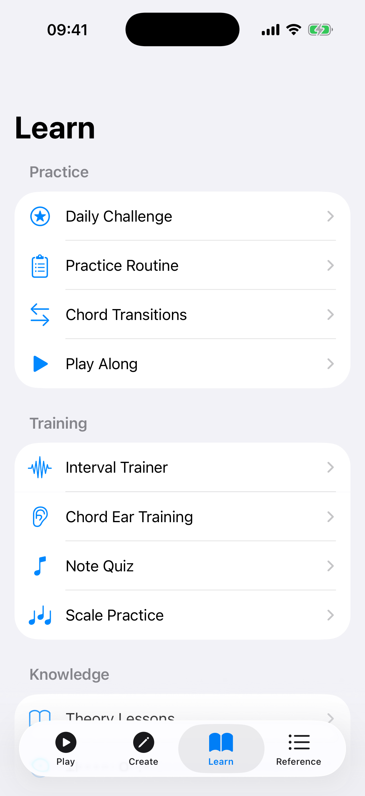

# Settings

Tap the **gear icon** in any tab's toolbar to open the Settings panel as a sheet. Settings are organized into sections.

## Sound

Control how the app plays back chords and notes.

| Setting | Description |
|---------|------------|
| **Sound Enabled** | Toggle all sound playback on or off. |
| **Volume** | Adjust the playback volume from 0% to 100%. |
| **Note Duration** | How long each note rings out (300–1200 ms). |
| **Strum Delay** | The delay between strings when strumming a chord (0–150 ms). A shorter delay sounds like a quick strum; a longer delay sounds like a slow arpeggio. |
| **Play on Tap** | When enabled, plays the note immediately when you tap a fret on the Explorer fretboard. |
| **Strum Down** | When on, chords strum from the lowest string to the highest; turn it off to strum the other way. |
| **Noise Gate** | Controls how much background noise is filtered for the Tuner, Pitch Monitor, and Melody Notepad (0–100%, default 75%). Higher values filter more noise; lower values pick up quieter sounds. Increase in noisy environments or decrease in a quiet room for maximum sensitivity. |

## Display

Customize the app's appearance and navigation.

### Theme

Choose from four theme options:

| Theme | Description |
|-------|------------|
| **Light** | Light background with dark text. |
| **Dark** | Dark background with light text, easier on the eyes in dim environments. |
| **System** | Follows your device's system-wide light/dark mode setting. |
| **High Contrast** | An accessibility-focused theme with stronger color contrast, making text and UI elements easier to read. Adapts to your system light/dark preference. |

| Setting | Description |
|---------|------------|
| **Show Tips** | When enabled, a rotating "Did You Know?" card appears on the Explorer. |
| **Show Learn Tab** | When enabled, the Learn tab (Theory, Quizzes, Ear Training, etc.) is visible in the tab bar. Disable to simplify navigation for experienced players. |
| **Show Reference Tab** | When enabled, the Reference tab (Capo Guide, Circle of Fifths, Glossary, etc.) is visible in the tab bar. |

The Settings panel also has a **Language** section for choosing the app's language.

## Tuning

Pick a tuning **Preset** for your ukulele. The app adjusts the fretboard, chord detection, and playback accordingly. Eight presets are available:

| Tuning | Strings | Description |
|--------|---------|------------|
| **High-G (Standard)** | G C E A (re-entrant) | The most common soprano/concert/tenor tuning with a re-entrant high G string. |
| **Low-G** | G C E A (low G) | Same notes but with the G string tuned an octave lower, extending the bass range. |
| **Baritone (DGBE)** | D G B E | Baritone ukulele tuning, matching the top four strings of a guitar. |
| **D-Tuning (ADF#B)** | A D F# B | A traditional alternative tuning, one whole step above standard. |
| **Slack Key (GCEG)** | G C E G | An open-G tuning for slack-key style playing. |
| **Open A (AC#EA)** | A C# E A | An open-A tuning. |
| **Low A (GCEa)** | G C E a | Standard notes with a low A on the bottom string. |
| **Half-Step Down** | F# B D# G# | Standard tuning lowered by a semitone. |

## Tuner

The Tuner section has its own options: **Auto-Start** (begin listening when the tuner opens), **Precision Mode**, **Auto-Advance** (move to the next string automatically), **Spoken Feedback**, and an **A4 Reference** slider (415–465 Hz) for adjusting the reference pitch.

## Fretboard

| Setting | Description |
|---------|------------|
| **Left-Handed** | Mirrors the fretboard so the nut appears on the right side, matching a left-handed player's perspective. |
| **Show Note Names** | Toggles note-name labels on the fretboard. |
| **Allow Muted Strings** | Allows generated voicings to include muted strings. |
| **Last Fret** | Sets how many frets the fretboard shows (12–22). |

## Backup & Restore

Export all your data — favorites, songs, melodies, progressions, custom patterns, setlists, learning progress, and settings — to a JSON file, and restore it later. Restoring merges the backup with your current data without overwriting existing items.

## Tips

- If you play a baritone ukulele, switch to the **Baritone (DGBE)** tuning so chord detection and playback match your instrument.
- Try the **High Contrast** theme if you find the default colors hard to read, especially in bright sunlight.
- Adjust the **volume slider** independently from your device volume for finer control over playback loudness.
- Disable the **Learn** and **Reference** sections if you want a simpler tab bar focused on playing and creating.
