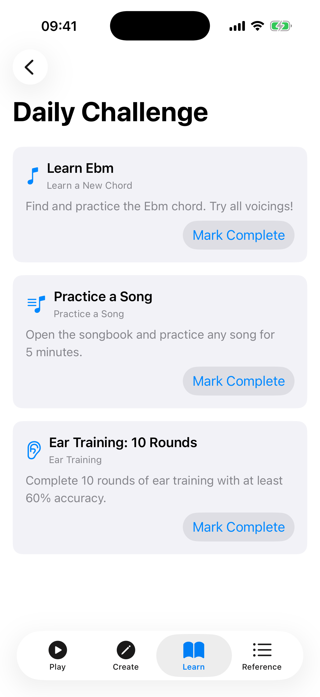
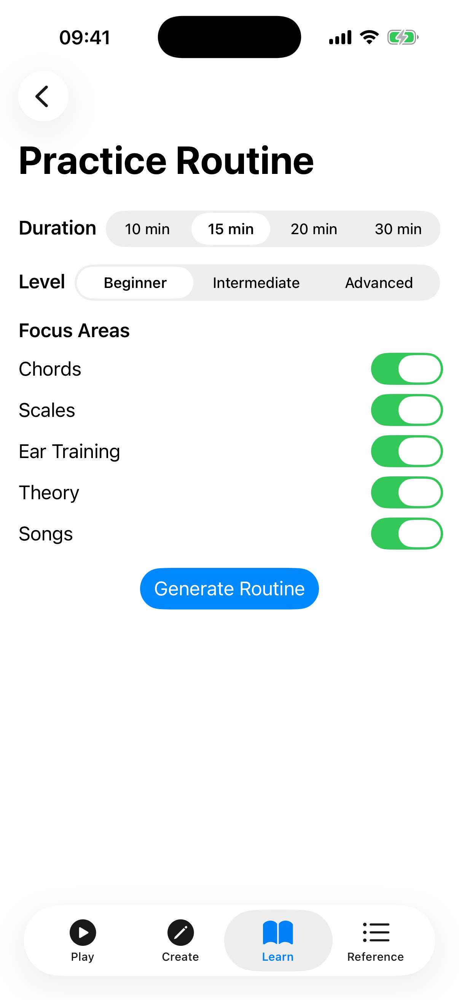
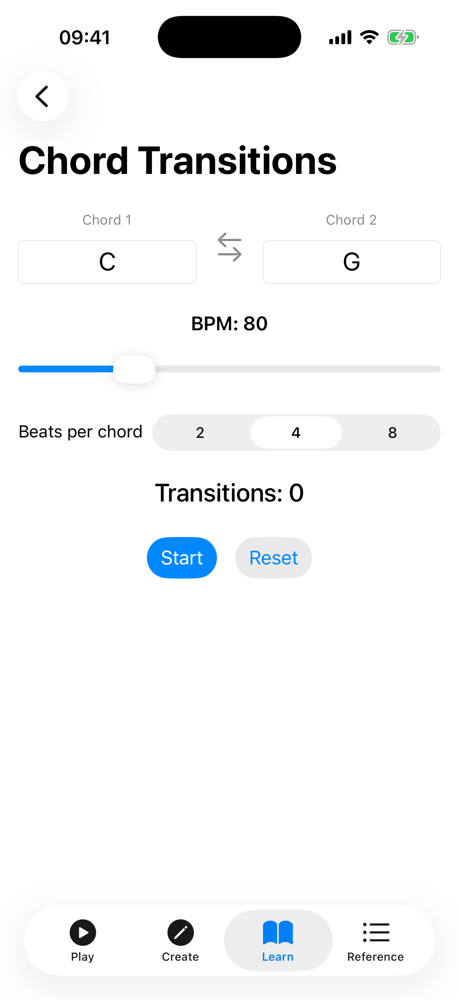

# Learning & Practice

Ukulele Companion includes a suite of learning and practice tools to help you build skills systematically. Access them from the **Learn** tab.

## Progress Dashboard

The Progress screen is your central hub for tracking improvement across all learning activities.

### Practice Time

At the top of the dashboard, the **Practice Time** card shows:

- **Today** — minutes practised today.
- **Total** — cumulative practice time across all sessions.
- **Sessions** — total number of practice sessions.
- **Daily goal** — progress bar towards your configurable daily target (default 15 minutes).

Practice time is tracked automatically whenever the app is open. Sessions longer than 1 minute are recorded when you leave the app.

### Statistics

Below the practice timer, the dashboard shows stats for each training activity:

- **Theory Lessons** — lessons completed and quizzes passed.
- **Theory Quiz** — overall score and accuracy.
- **Interval Trainer** — accuracy and attempts.
- **Note Quiz** — score, accuracy, and best streak.
- **Chord Ear Training** — accuracy and attempts.
- **Scale Practice** — totals, accuracy, and best streak.

## Daily Challenge

Three fresh challenges are generated every day to keep your practice varied and engaging.

Each challenge card shows:

- An **icon** indicating the challenge type, with the challenge **title** and type label.
- The **challenge description** (e.g., "Learn C", "Theory Quiz: 10 Questions", "Practice: Happy Birthday").
- A **Mark Complete** button to check the challenge off once you have done it.

Below the challenges, a **Tip of the Day** provides a quick piece of practice advice.

Challenges are generated deterministically based on the date, so they are the same if you check multiple times in a day but different each new day.

## Practice Routine

The Practice Routine builder creates a structured, guided session tailored to your needs.

### Setting Up

1. **Duration** — drag the slider to set your available time (5–60 minutes).
2. **Level** — choose Beginner, Intermediate, or Advanced.
3. **Focus Areas** — select which skills to include: Chords, Scales, Ear Training, Theory, Songs.
4. Tap **Generate Routine**, then **Start Routine**.

### Following the Routine

The app generates a sequence of steps:

- **Warm-up** — a gentle start (e.g., easy chord changes).
- **Focused exercises** — exercises matched to your focus areas and skill level, each with a suggested duration.
- **Cool-down** — a relaxing finish.

Each step shows a numbered badge, title, and time allocation. Tap a step to expand its description, then tap **Done** to mark it complete and advance to the next one. A progress indicator tracks your overall routine completion.

## Achievements

Earn badges by reaching milestones as you use the app.

### Achievement Categories

- **Practice** — practice streaks, consistency, and scale-practice milestones.
- **Learning** — lesson and quiz milestones.
- **Ear Training** — interval and chord ear-training accuracy.
- **Songs** — songbook milestones.
- **Chords** — chord and favorites milestones.

### Viewing Achievements

The gallery shows how many achievements you have unlocked out of a total of 21, and lists all of them. Filter by category using the chips at the top. Locked achievements are shown dimmed with their unlock criteria visible, so you always know what to work towards.

## Tips

- Check the Daily Challenge each day for motivation and variety.
- Use Practice Routine when you have a set amount of time and want structure.
- Review the Progress dashboard periodically to identify areas that need more attention.
