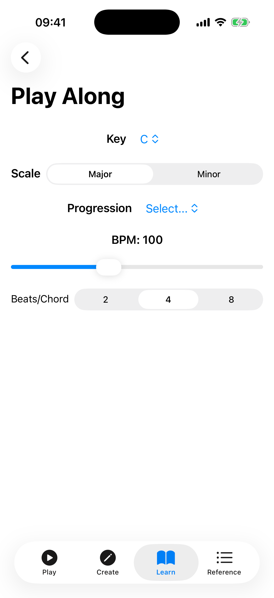
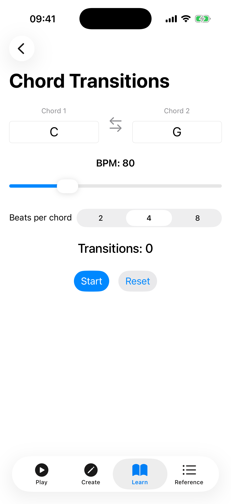

# Play Along & Chord Training

These features use real-time audio and timed prompts to help you practise chord changes and playing accuracy.

## Play Along

Play Along lets you practise a chord progression with real-time feedback from your microphone. The app listens to your ukulele and tells you whether you are playing the correct chord.

### Setup

1. **Key** — pick a root note (C, C#, D, ... B) from the Key picker.
2. **Scale** — choose Major or Minor.
3. **Progression** — pick a progression from the Progression picker. After you choose one, its chords (resolved into your chosen key) appear as a row of chips below.

### Playing

After selecting a progression, the play-along screen shows:

- **Chord strip** — a row of all chords in the progression. The current chord is highlighted while playing.
- **Current chord display** — a large label showing the chord you should be playing right now.
- **Beat indicators** — dots that fill in as each beat of the current chord passes.
- **Live detection feedback** — when the microphone is active, the app shows what chord it hears ("Heard: …") and whether it matches the expected chord (green check for correct, red X for incorrect).
- **Score card** — accuracy percentage, letter grade (S/A/B/C/D/F), and best streak.

### Controls

- **BPM slider** — adjust the tempo from 40 to 200 BPM.
- **Beats/Chord** — choose 2, 4, or 8 beats before the progression advances to the next chord.
- **Play/Stop button** — starts or stops the session. When playing, the progression advances automatically in time.

### Microphone Permission

Play Along requires microphone access for chord detection. The first time you use it, the app will prompt you to grant permission. If you decline, you can still use the progression playback and metronome without detection feedback.

### Scoring

Each beat is scored based on whether the detected chord matches the expected chord. At the end of a session (or when you stop), the score card shows:

- **Accuracy** — percentage of beats with correct chord detection.
- **Grade** — a letter grade from S (95%+) to F (below 40%).
- **Best Streak** — the longest consecutive run of correct beats.

## Chord Transitions

The Chord Transition Trainer helps you drill switching between two chords in time, so you can build muscle memory for a change that gives you trouble.

### Setup

1. **Chord 1** — select the root note and chord quality for the starting chord.
2. **Chord 2** — select the root note and chord quality for the target chord.

The app shows both chord diagrams (stacked with an arrow between them) so you can see the finger positions. Tap a diagram to hear that chord.

### Controls

- **BPM slider** — sets the tempo of the drill (40–200 BPM).
- **Tap** — set the tempo by tapping rhythmically.
- **Beats per chord** — choose 1, 2, 4, or 8 beats before switching chords.
- **Play chord on transition** — when on, the chord is strummed each time it changes.
- **Start button** — begins the timed drill.
- **Reset button** — clears the transition count and timer.

### During the Drill

While the drill runs, the app shows the **current chord** in large text with **beat indicators** that fill as each beat passes, prompting you when to switch. Below, a stats row tracks your **transition count**, **elapsed time**, and **switches per minute** so you can measure your progress.

## Tips

- Start Play Along at a slow BPM (60–80) and increase as you get comfortable.
- Use Chord Transitions to practise the specific chord changes that give you trouble.
- Combine these tools: use Chord Transitions to learn a change, then Play Along to practise it in context.
