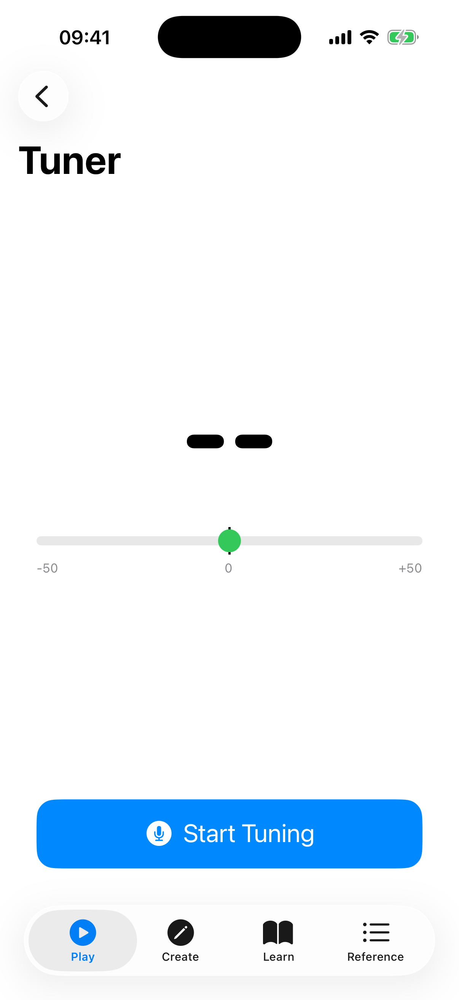

# Tuner

The Tuner is a chromatic tuner that listens to your ukulele through the microphone and shows whether each string is in tune.

## How to Use

1. Tap **Start Tuning** to begin listening.
2. Play an open string on your ukulele.
3. The tuner displays the detected note, a semicircular meter showing how sharp or flat the pitch is, and text guidance ("Tune up", "Tune down", or "In tune").
4. Adjust the tuning peg until the needle centers and the note turns green.
5. Repeat for each string.

## Tuner Display

- **Note name** — large, color-coded text showing the detected pitch. Green means in tune, yellow means close, and red means the string needs significant adjustment.
- **Needle meter** — a semicircular gauge showing the deviation in cents (-50 to +50). Center is perfectly in tune.
- **Cents display** — a numeric readout (e.g., "+5 ¢") for precise tuning.
- **Guidance text** — "Tune up", "Tune down", or "In tune" to tell you which direction to adjust.

## String Buttons

Four buttons at the bottom show the open strings for your selected tuning (G, C, E, A in standard High-G). Tap a string button to hear its reference pitch. A checkmark appears on strings that have been successfully tuned.

## Haptic Feedback

The tuner vibrates briefly when a string enters the in-tune zone, providing tactile confirmation that is especially useful when visual attention is elsewhere or for users who rely on non-visual feedback.

## Neural Pitch Detection

The tuner uses a hybrid pitch detection pipeline. When you first open the tuner, a **SwiftF0 Loading...** badge appears while the neural model initializes in the background. Once ready, the badge changes to **SwiftF0 Active**, indicating that neural pitch supervision is running alongside the standard YIN algorithm, improving accuracy for difficult-to-detect pitches and reducing octave errors. If the model fails to load, the badge shows **SwiftF0 Fallback** and the tuner continues with the YIN algorithm alone.

## Accessibility

- **Needle meter zones** — VoiceOver announces the current zone (In tune, Close, Flat, Sharp, or No signal) as the pitch changes, so you can tune by ear and spoken feedback alone.
- **Reduce motion** — If reduce motion is enabled in system accessibility settings, all tuner animations (needle, color transitions, celebration effects) are replaced with instant state changes.
- **Neural badge** — The SwiftF0 status badge is announced to VoiceOver with its current state.

## Tuning Modes

The tuner adapts to whichever tuning you have selected in [Settings](08-settings.md). Available tunings include High-G (standard), Low-G, Baritone, D-Tuning, and more.

## Tips

- Tune in a quiet environment for the best results.
- Play each string firmly and let it ring — the tuner needs a clear, sustained tone.
- Tune from below the target pitch upward for better tuning stability.
- The string buttons double as reference tones — tap them to hear what the string should sound like.
- If the tuner picks up background noise, increase the **Noise filtering** slider in Settings. If it struggles to detect quiet playing, lower it.
