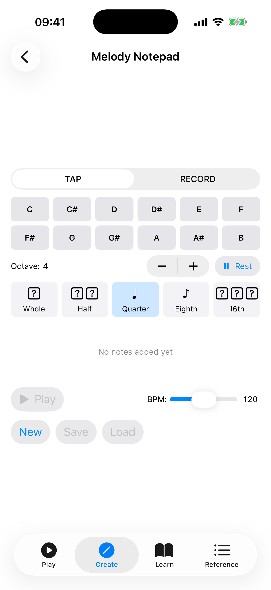

# Melody Notepad

The Melody Notepad is a melody composer and sequencer with two input modes — **Linear** (tap or record notes one at a time) and **Step Sequencer** (fill a grid of 8 or 16 steps). Create melodies, loops, and rhythmic patterns, then play them back at any tempo.

## Creating a Melody

### Tap Mode

1. Select a **note duration** (Whole, Half, Quarter, Eighth, or Sixteenth) using the duration chips.
2. Choose the **octave** (3-6) using the up/down arrows.
3. Tap any of the 12 note buttons (C through B) to add a note to the sequence.
4. Tap the **Rest** button to insert a rest of the selected duration.

Notes appear in the sequence display at the top as colored blocks showing the note name and duration.

### Record Mode

1. Tap **Record** to switch to recording mode.
2. Tap the microphone button to start listening.
3. Play a note on your ukulele — the app detects the pitch and adds it to the sequence once the note stabilizes.
4. Continue playing notes to build the melody.
5. Tap stop when finished.

### Step Sequencer Mode

Toggle from Linear to **Step Sequencer** mode using the mode switch at the top.

1. The sequencer shows a grid of **8 steps** by default. Tap the **16 Steps** button to expand it, or **8 Steps** to shrink it back.
2. Tap any step in the grid to open a **pitch picker** and choose a note name for that step. The octave comes from the **Octave** stepper below the grid.
3. Use the context menu (or the pitch picker's **Clear** button) on a step to clear it back to silence.
4. Tap **Play** to play the sequence at the current BPM; turn on the **loop** button to repeat it continuously. The active step is highlighted as it plays.
5. Tap **Stop** to end playback, and **Clear** to empty the grid.

The step sequencer is ideal for building rhythmic patterns and loop-based ideas without worrying about note durations — each step has equal timing determined by the BPM.

## Editing

- Tap any note in the sequence to select it. The selected note is highlighted.
- Tap the **×** badge on the selected note to remove it.
- The sequence wraps onto multiple rows and scrolls vertically if it grows long.

## Playback

- Set the **BPM** using the slider (40-200 BPM).
- Tap **Play** to hear the melody played back. The current note is highlighted during playback.
- Tap **Stop** to halt playback.

## Saving and Loading

Melodies are saved to the device and persist between sessions. In Linear mode you have these buttons:

- **New** — start a fresh empty melody (you will be prompted to discard unsaved changes first).
- **Save** — name and save the current melody.
- **Load** — open the saved-melody list and tap one to load it.

In the Load list, swipe a melody to **Rename** or **Delete** it.

## Tips

- Use Tap mode for precise control over note placement and duration.
- Use Record mode to quickly capture a melody idea by playing it on your ukulele.
- Use Step Sequencer mode for rhythmic patterns and loop-based ideas — great for experimenting with riffs.
- Start with quarter notes for simple melodies, then add eighth and sixteenth notes for faster passages.
- Experiment with different octaves to create melodies that span the full ukulele range.
- In Record mode, if the app picks up unwanted notes from background noise, increase the **Noise Gate** slider in Settings.
- In the step sequencer, start with 8 steps for short loops and expand to 16 when you need a longer phrase.
