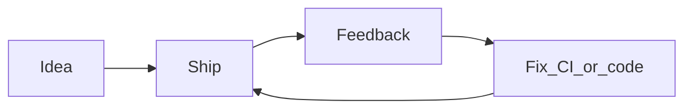

<!-- _class: lead -->

# Building Ukulele Companion

**Android-first · fully offline · accessibility-minded**

<!--
Speaker: Introduce yourself and the repo (~275 commits on main). Root commit 9abb4b3 “Ukulele Fretboard Chord Explorer.” This deck is about *process*, not a feature tour.
-->

---

## Why this app · who it’s for

- Free reference and practice tool — **no ads, no network dependency**
- A meaningful share of users rely on **TalkBack** and need the same depth as sighted players
- Constraints in `AGENTS.md`: offline, no telemetry, preserve accessibility when changing UI

<!--
Point to AGENTS.md in the repo. Emphasize that “blind and VI musicians” is a design constraint, not a nice-to-have. Mention High-G / Low-G and left-handed mode if you want credibility with players.
-->

---

## Start small: one sharp problem

- **Initial commit** — fretboard chord explorer: tap frets → chord name
- **Next** — chord library, voicings, diagram sizing and rendering fixes  
  Commits: `519f876`, `75fd16d`

<!--
Narrative: prove the core loop before sprawling. Early commits are mostly Android UI + music logic co-evolving.
-->

---

## Big vertical slices vs mega batches

- **v2** — transpose, patterns, progressions, scale overlay, favorites, songbook, widget in one jump (`9b3554c`)
- **v3** — theory + composition; product rename to **Ukulele Companion** (`86c67a5`, `ac23cf9`)
- Later: **“12 new features from mega plan”** (`588674b`)

<!--
Honest slide: sometimes you ship a versioned bundle; sometimes one large plan. What worked: having a manual/README to catch up; what was risky: integration load. Adjust story to your experience.
-->

---

## Product correction: trust over convenience

- Shipped **Google Drive sync** for settings/data (`0cf7dc8`)
- **v5.0** — removed cloud sync; **local backup/restore** only (`8722e19`)

**Takeaway:** offline + user control aligned better with the product promise than cloud convenience.

<!--
This is a strong “values in engineering” moment. Pair with privacy policy / optional microphone (74acc19) if you want a privacy thread.
-->

---

## Audio: from synthesis to signal processing

- **Sampled ukulele** playback instead of sine waves (`f7c269f`)
- **Tuner evolution** — fast **YIN** pipeline, overlap, gating, UI polish (`0d6af3b`)
- **Hybrid pipeline** — neural supervisor + ONNX on top of YIN (`babf118`, design `403a847`)

<!--
Android: ToneGenerator / capture at 44.1 kHz (see AGENTS.md). You can show a block diagram verbally: PCM → YIN → (periodic) neural check → UI needle.
-->

---

## On-device ML (no cloud)

- **ONNX Runtime** on device — same constraint on Android and iOS
- Spec deep-dive in repo: `docs/spec/22-neural-pitch-supervisor.md`
- Dependency hygiene — e.g. ONNX bumps for **16 KB page** alignment (`84e830d`)

<!--
If the room is non-technical, shorten to: “small neural net runs on the phone; nothing leaves the device.” If technical, mention Kotlin 2.3.10 bump (38f2836) as part of staying current.
-->

---

## Android architecture today

- **Jetpack Compose** (Material 3), **single Activity**, drawer navigation (no NavHost)
- **MVVM** + **`StateFlow`**; logic-heavy code trends toward **KMP `shared`**
- Platform: audio engines, ONNX, preferences — see `AGENTS.md` package map

<!--
54 Compose screens is a good “scale” stat if you want it. Mention where complexity lives: domain in shared, UI in app.
-->

---

## Accessibility as process

- **TalkBack**: headings, live regions, Canvas semantics, focus order — see `.cursor/rules/compose-accessibility.mdc`
- Treat regressions like functional bugs
- Left-handed / tuning variants must stay coherent when fretboard changes

<!--
Optional demo: navigate one screen with TalkBack on. If no live demo, show one before/after lesson from a real fix (e.g. drawer or chord diagram labels).
-->

---

## Testing & CI

- **GitHub Actions** — lint, unit tests, builds (`8cbce39` and follow-ups)
- **Dependabot** for Gradle + actions; lint baseline when needed
- **Property-based fuzz tests** + monkey stress script (`61c23f5`)

<!--
Mention what you run before release: assembleDebug, lint, tests from AGENTS.md. iOS added ViewModel tests later (b56c872) — optional cross-platform note.
-->

---

## Documentation for future you

- **README** — features, stack, badges, screenshots
- **User manual** — `docs/manual/android/` (and iOS mirror)
- **Specs** — `docs/spec/` for tuner, playback, parity decisions
- **AGENTS.md** + **Cursor rules** — encode non-negotiables for humans and AI

<!--
47a090c: AGENTS split into glob-targeted rules. Good “scaling solo/small team” story.
-->

---

## Second platform: KMP + iOS

- **`:shared`** module and **full iOS port** land together (`995d9bf`)
- **iOS 16** deployment target (`a2fe375`); **iPad** sidebar / adaptive layout (`00b52a4`)
- **Parity is ongoing** — Favorites, Progressions, Songbook, audio, chord diagrams (many fix commits)

<!--
Android remains the spine of the talk; iOS is “same product, second surface.” Mention shared.framework via Gradle if the audience cares.
-->

---

## Shipping

- Version tags, Play and App Store pipelines
- Repo **skills**: `github-release`, `android-release`, `ios-release` (`b5dd027`); store assets workflows (`a44b9a8`)
- **CodeRabbit** on PRs; issue planner for triage (`051ac6c`, `b11145b`)

<!--
Lightweight ops story: automation lives next to code. Don’t read internal playbook aloud—point at `.cursor/skills/` or docs.
-->

---

## AI in the loop (optional lens)

- **Crash reports** — hypotheses, minimal instrumentation, fix, new build (e.g. TestFlight mic permission on new OS)
- **Visual QA** — screenshot-led alignment bugs; match proven patterns from Android on iOS
- Rules + `AGENTS.md` keep assistants aligned with offline / a11y constraints

<!--
Do not read chat logs aloud. Personal examples only. Transcript-style sessions in Cursor illustrate triage → repro → ship; keep it one minute.
-->

---

## Lessons learned (fill in live)

1. _______________________________________
2. _______________________________________
3. _______________________________________
4. _______________________________________
5. _______________________________________

<!--
Replace blanks with your real list. Suggested seeds: “ship vertical slices,” “backup beats sync for this audience,” “a11y early,” “spec before ONNX tuning,” “parity is a product feature.”
-->

---

## Demo · Q&A

**Suggested Android path:** Explorer → Chord Library voicing → Tuner (or Pitch Monitor)

<!--
Mermaid may require a recent Marp CLI/extension. If it fails to render, delete the code block or export with `--allow-local-files`. Demo: keep under 2 minutes; leave time for questions.
-->

---

## Appendix: optional visuals

Add images under `docs/talk/assets/` and reference them here, for example:

- `assets/android-explorer.png` — Explorer tab  
- `assets/ci-green.png` — passing workflow (screenshot Actions)  
- `assets/git-log.png` — `git log --oneline --graph` excerpt

See also screenshot grid in the root **README.md**.

<!--
This slide is for PDF handouts. Remove or hide if you prefer a clean deck. Marp: ``.
-->
